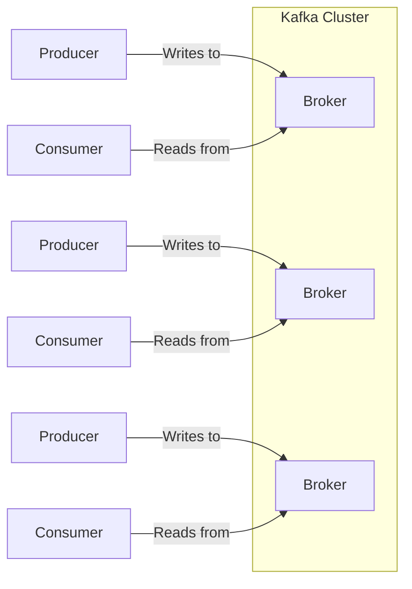

# Apache Kafka

Kafka adopts event-based communication paradigm instead of remote procedure calls or remote service invocations.

The main benefit of this is decoupling, synchronization decoupling, and time decoupling: the producers/consumers don't need to know each other.



**Most important Kafka stuff:**


- **Topic:** A category or feed name to which messages are published. 
- **Partition:** A split within a topic for parallel processing.
- **Producer:** Component that publishes messages to Kafka topics.
- **Consumer:** Component that subscribes to topics and processes messages. 
- **Consumer Group:** A group of consumers acting as a single logical subscriber, where each consumer reads messages from a distinct set of partitions.
- **Broker:** A Kafka server that stores data and serves clients.
- **ZooKeeper:** A service for coordinating and managing the Kafka brokers.
	- Coordinates and manages Kafka brokers.
	- Maintains cluster membership and metadata.
	- Handles leader election for partitions.
	- Essential for Kafka's distributed nature.
	- Being replaced by Kafka's own internal mechanisms in newer versions.
- **Replication:** Kafka's method of fault tolerance by duplicating partitions across multiple brokers.
	- Replicates partitions across multiple brokers.
	- Designates one broker as the leader for each partition.
	- Followers replicate data from the leader.
	- On leader failure, a follower is promoted.
	- Ensures no data loss and service continuity.
- **Consumer Offset**:
	- Marks position of a consumer in a partition.
	- Unique ID for each message read.
	- Allows consumers to resume from where they left off.
	- Committed periodically for reliability.
	- Managed per consumer in a group for distributed processing.

## Pull based

Consumers pull messages from brokers, which offers several advantages. Unlike other messaging systems that use a push-based interaction, Kafka's pull-based approach:

- Eliminates the need for brokers to store consumer state. Instead, consumers are responsible for storing the offset of the last position they have read. This flexibility enables adding more consumers to the system without reconfiguring the cluster.
- Enables consumers to resume from where they left off when they come back online after being offline.
- Allows consumers to pull and process data at their own sustained speed, without negatively impacting producers or the cluster.

## Basic classes 

### Basic Consumer

A basic consumer is suitable for simple consumption patterns where exactly-once processing is not critical.
```Java
//props is a list of proprierties 
KafkaConsumer<String, String> consumer = new KafkaConsumer<>(props); 

consumer.subscribe(Collections.singletonList(topic));

while (true) {

final ConsumerRecords<String, String> records = consumer.poll(Duration.of(5, ChronoUnit.MINUTES));
  
//operations with records ...
```

some interesting properties can be:

- **Auto-Commit Enabled:** Automatically commits offsets at regular intervals.
```Java
props.put(ConsumerConfig.ENABLE_AUTO_COMMIT_CONFIG, String.valueOf(true)); props.put(ConsumerConfig.AUTO_COMMIT_INTERVAL_MS_CONFIG, String.valueOf(autoCommitIntervalMs));
```
- **Offset Reset Strategy:** Starts from the latest offset if no previous offset is found.  
```Java
props.put(ConsumerConfig.AUTO_OFFSET_RESET_CONFIG, "latest");
```

### Basic Producer

Suitable for general-purpose message production where transactional guarantees are not required: 
- **Send and Optionally Wait for Ack:** Sends messages without transactional control, with optional wait for acknowledgment.

 ```Java
final ProducerRecord<String, String> record = new ProducerRecord<>(topic, key, value);
final Future<RecordMetadata> future = producer.send(record);
```
   
### Topic Manager

The `TopicManager` class is a Kafka administration utility designed to manage Kafka topics. It's useful for creating, deleting, and listing topics in a Kafka cluster. 
Note that by default, a topic is created when it is first used. 

```Java
NewTopic newTopic = new NewTopic(topicName, topicPartitions, replicationFactor);
```    

## Semantics and Idempotence

In communication theory, message delivery can be provided with different guarantees:

1. **at Most Once Semantics**: no duplicates, but messages can be lost
2. **at Least Once Semantics**: messages can be delivered more than once, but they are not lost.
3. **Exactly Once Semantics  (EOS)**: the system behaves as if each message was delivered once and exactly once.  In Kafka this is achieved through **idempotent** operations and transactional updates of offsets. 

**Idempotence** means that a producer can safely retry sending messages without worrying about duplicate messages being created. This is part of Kafka's "exactly once" semantics, which ensures that each message is delivered exactly once to the intended recipients. This line sets the `ENABLE_IDEMPOTENCE_CONFIG` property of the producer to `true`, which enables idempotence.

```Java
 // Idempotence = exactly once semantics between the producer and the partition
props.put(ProducerConfig.ENABLE_IDEMPOTENCE_CONFIG, String.valueOf(true));
```

## Transactional 

If a producer sends messages as part of a transaction, you can use the **isolation level** to control whether a consumer reads these messages before the transaction is committed.
The isolation level determines how the consumer reads messages that are part of a transaction:

### Transactional Consumer

Ideal for scenarios requiring data consistency and exactly-once processing in a transactional context.

```Java

props.put(ConsumerConfig.ISOLATION_LEVEL_CONFIG, "read_committed");

//or also messages that are part of a transaction that hasn't been committed yet:

props.put(ConsumerConfig.ISOLATION_LEVEL_CONFIG, "read_uncommitted");
```

### Transactional Producer

A Transactional Producer is designed for transactional message delivery, ensuring atomicity and consistency in message production.
**Transactional ID** is configured with a transactional ID for transactional message delivery.

```Java
props.put(ProducerConfig.TRANSACTIONAL_ID_CONFIG, transactionalId);
```

**Transaction Management:** Manages transactions explicitly with `beginTransaction`, `commitTransaction`, and `abortTransaction`.

```Java
// This must be called before any method that involves transactions
producer.initTransactions();

producer.beginTransaction(); 
producer.send(record); 
// Commit or abort based on some condition 
producer.commitTransaction(); 
// or 
producer.abortTransaction();
```

Example:

```Java
producer.initTransactions();

final ProducerRecord<String, String> record = new ProducerRecord<>(topic, key, value);

producer.beginTransaction();

producer.send(record);

if (condition) producer.commitTransaction();
else {
	// If not flushed, aborted messages are deleted from the outgoing buffer
	producer.flush();
	producer.abortTransaction();
}
```

### Atomic Forwarder

An object/instance can be both Consumer and Producer. We called it `AtomicForwarder`, which is designed for transactional message **forwarding**, ensuring EOS. 

```Java
KafkaConsumer<String, String> consumer = new KafkaConsumer<>(consumerProps); 

KafkaProducer<String, String> producer = new KafkaProducer<>(producerProps);
```    

Sets up **consumer** properties including server address, group ID, deserializers, and isolation level.

```Java
consumerProps.put(ConsumerConfig.ISOLATION_LEVEL_CONFIG, "read_committed"); 

consumerProps.put(ConsumerConfig.ENABLE_AUTO_COMMIT_CONFIG, String.valueOf(false));
```
    
Configures the producer with a transactional ID and enables idempotence:
    
```java
producerProps.put(ProducerConfig.TRANSACTIONAL_ID_CONFIG, producerTransactionalId); 

producerProps.put(ProducerConfig.ENABLE_IDEMPOTENCE_CONFIG, String.valueOf(true));
```   

And then **Polling and Forwarding**: continuously polls for new records and forwards them to another topic within a transaction.
    
```java

// This must be called before any method that involves transactions
producer.initTransactions();

//...

final ConsumerRecords<String, String> records = consumer.poll(Duration.of(5, ChronoUnit.MINUTES)); 

producer.beginTransaction(); 

for (final ConsumerRecord<String, String> record : records){
	producer.send(new ProducerRecord<>(outputTopic,record.key(),record.value())); 
}

//Manual offset management **within** the transaction
producer.sendOffsetsToTransaction(map,consumer.groupMetadata()); 

producer.commitTransaction();
```


If you have one partition and two consumers in the same consumer group, only one of the consumers will be able to read from the partition. This is because in Kafka, each partition is consumed by exactly one consumer in a group at a time. The other consumer will be idle and won't receive any messages unless the active consumer goes down. If the active consumer fails, the other consumer will take over and start consuming messages from the partition.


Partitions in Kafka primarily speed up the consumption of data. By having multiple partitions, you can have multiple consumers in a consumer group each reading from a different partition concurrently, thus allowing for data to be read in parallel. This increases the throughput of data consumption.


If there are two consumers and two partitions, each consumer will be reading from one partition. If one consumer fails, Kafka's consumer group coordinator will notice the failure (due to the lack of heartbeat from the failed consumer) and trigger a rebalance of the consumer group. The remaining consumer will take over the partition that was being read by the failed consumer, in addition to the partition it was already consuming. So, the remaining consumer will start consuming messages from both partitions.


**Rebalancing**: When a consumer fails (or a new consumer joins, or a topic partition count changes), Kafka triggers a rebalance. During a rebalance, the broker reassigns the partitions among the available consumers in the group.