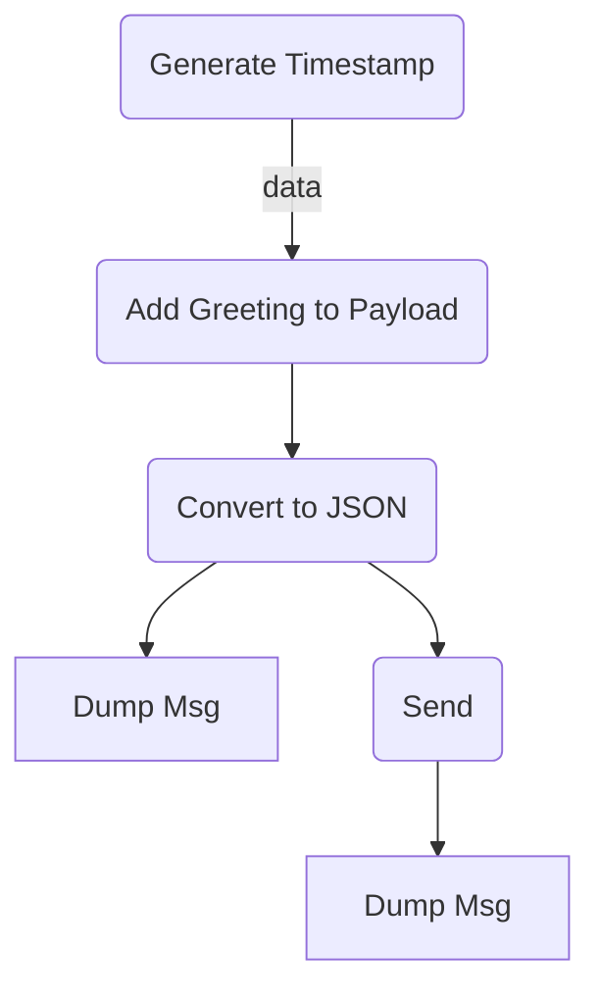
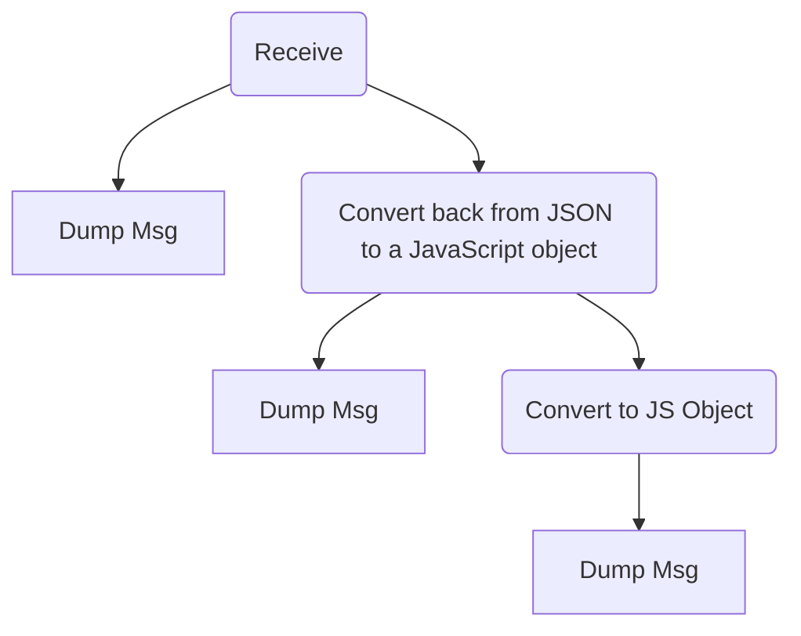

# Node Red 

The lecture focuses on Node-RED, a visual tool used in the computing continuum for application development. Key aspects of Node-RED covered include:

## Node-RED Overview

Based on a flow-based programming paradigm that defines applications as networks of "black box" processes. These processes, which are often referred to as nodes, operate independently and exchange data through defined connections known as data streams or channels.
Flow based programming highlights: 
1. **Data-Driven Design**: Processes execute based on the availability of data.
2. **Modularity and Reusability**: Processes are modular and reusable across different applications.
3. **Independent Processes**: Each process operates independently, facilitating concurrent execution.
4. **Network of Processes**: Applications are structured as networks with nodes connected by data channels.
5. **Emphasis on Connection and Communication**: Focuses on how processes connect and communicate.
6. **Scalability and Flexibility**: Allows for easy adaptation and evolution of applications.
7. **Suitable for Parallel Processing**: Ideal for parallel and distributed computing.
8. **Application in Various Domains**: Applicable in data-intensive, real-time applications, and various other domains.

Node-RED is built on top of the Node.js runtime, utilizing a non-blocking, event-driven model for efficient and parallel implementations.
Node-RED features a **node-based GUI**, making application development and visualization straightforward.
There is a basic set of nodes, but extensible with additional nodes available from an online catalog.

Function nodes are also possible and allow to write JavaScript code to perform specific tasks. This can include manipulating message payloads, setting message properties, or implementing complex logic that is not directly achievable with other node types.

UDP nodes permit to listen for UDP packets on unique ports or send packets to designated addresses and ports. UDP nodes center on network communication, making them perfect when fast data transmission is prioritized over reliability and order.

The **execution and flows** in Node-RED are asynchronously and flows can be saved and loaded as JSON files, facilitating sharing and management. Each message in Node-RED is structured as JavaScript objects and the key properties include topic, payload, and message ID.
Node Red is strongly **used in IoT applications** due to its real-time data processing and visualization capabilities.

## MQTT 

MQTT is an extremely lightweight pub/sub messaging layer that is payload agnostic. It emphasizes the topic-based organization of this type of messaging layer, where topics are systematically arranged in a hierarchical order.

MQTT handles messages as Strings When publishing, JavaScript objects are automatically converted to JSON — No need for an explicit JSON conversion node When receiving from a matching subscription, the output may be converted directly to a JavaScript object

MQTT QoS is a per-message agreement on the guarantees on delivery

MQTT Persisten essions
Normal behavior:
— Clients subscribe upon connecting to the broker
— Subscriptions are lost when disconnecting
Persistent sessions save the subscriptions of
clients as they go off-line
• If so, the MQTT broker queues all QoS1 and QoS2
messages published while that client was off-line
• The client automatically
re-send unconfirmed QoS1
and QoS2 published messages
• Careful: may backfire if the
client is Ion disconnected