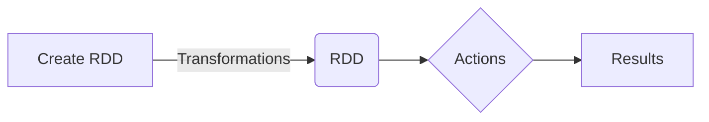
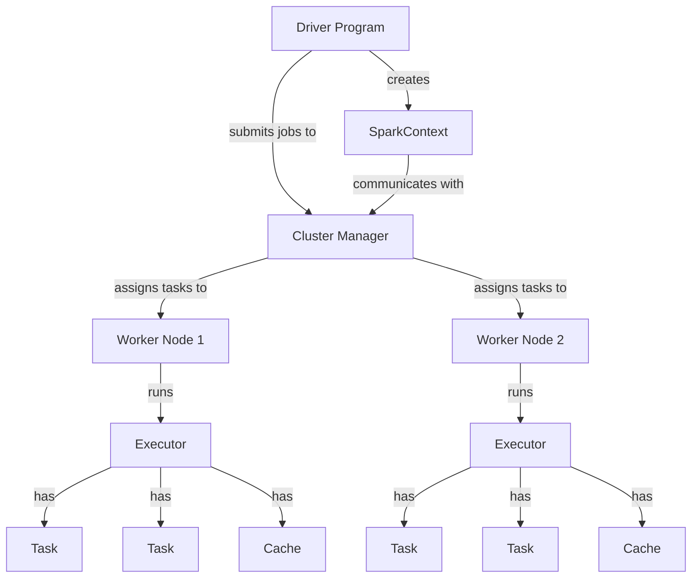
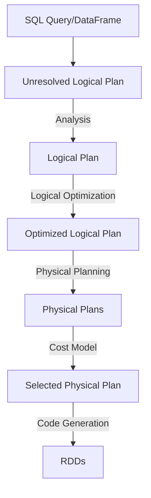

# Apache Spark

Apache Spark is an unified analytics engine for large-scale data processing. It is based on the dataflow programming model and is more expressive and efficient than the original MapReduce framework, supporting iterative computations and caching data in main memory.

## RDD

**RDD (Resilient Distributed Dataset)** is the primary abstraction in Spark, RDDs are collections of elements partitioned across cluster nodes, allowing parallel processing and fault tolerance.
RDDs can be created from:

- Existing collections in the driver program
- External datasets
- Local filesystem
- HDFS
- Kafka topics
- Several DBMSs
- ...


**RDD Operations**:


- actions return a value to the driver program after running a computation on the dataset. 
- transformations: create a new RDD from an existing one. Transformations are lazy, computed only when required by an action.



```java
// Creates an RDD. The number of partitions is decided based on the available workers
JavaRDD<String> lines = sc.textFile("data.txt");

// Transformation. Map applies a function to each and every element of the original RDD.
// In this case, it transforms each string (line) into a number (the length of the line)
JavaRDD<Integer> linesLen = lines.map(s -> s.length());

// Action. Reduce aggregates all the values into a single element and returns the result to the driver.
// In this case, it returns the sum of the lengths of all the lines
int totLen = linesLen.reduce((a, b) -> a + b);
```

 **APIs and Languages**:
    - It offers different APIs/languages including SQL, DataFrame API, and Dataset API, with the ability to switch between them based on application needs.
3. **SQL API**:
    - The SQL API allows for executing standard SQL queries from various interfaces including programming languages, command-line, JDBC/ODBC, etc.
4. **Datasets and DataFrames**:
    - Datasets provide the abstraction of RDDs with additional benefits like specialized encoders for serialization and performance optimizations.
    - DataFrames are a type of Dataset representing relational tables with a fixed and known schema, similar to SQL tables.
6. **DataFrame Creation and Operations**:
    - DataFrames can be created from various sources or from RDDs, with the ability to perform operations like filtering, sorting, and aggregating.
7. **Execution and Optimization**:
    - Spark SQL compiles queries into RDD operations with optimizations such as logical planning, physical planning, code generation, and SQL visualization tools for performance tuning.


## Datasets and Dataframes


**Datasets and DataFrames**

DataFrames, resembling spreadsheets, are untyped tables with rows and columns. They're used in Spark languages - Scala, Java, Python, and R. They're helpful for extensive columnar operations, SQL queries, and data sources.
DataFrames are equivalent to SQL, but defined programmatically
- Pro: automated optimization, syntax errors detected at compile time
- Cons: reduced flexibility


Datasets in Spark are similar to Java Collections API, but with the advantage of Spark's big data processing capabilities. They use a specific encoder for object serialization and transmission over the network. Because Spark knows the format, it can perform operations like filtering, sorting, and hashing without removing the object's serialization.
Datasets are also strongly typed, providing compile-time safety and aiding in catching errors early, preventing potential runtime issues in data processing pipelines.
However, Datasets are only supported in Scala and Java due to their structured nature. As Python and R use dynamic typing, they don't fully support Datasets. Thus, Datasets are especially useful when dealing with structured data and when there's a need to use Spark's functional programming API with type-safety.

Datasets are typed: not Rows, but structures
- Pro: syntax errors detected at compile time, more flexibility with user-defined lambdas
- Cons: possibilities for optimizations reduced by the presence of user-defined functions

SQL is totally declarative (queries are strings)

- Pro: automated optimization
- Cons: reduced flexibility, syntax errors detected at runtime

## Spark Architecture

Tasks are scheduled in worker nodes.





```java

// Build the SparkSession
SparkSession spark = SparkSession
    .builder()
    .appName("App name")
    .master("local") //Sets the Spark master URL to connect to
    .config("option name", "option value")
    .getOrCreate(); 

// Creating DataFrames from various sources
DataFrame dfJson = spark.read.json("path/to/json/file");
DataFrame dfCsv = spark.read.csv("path/to/csv/file");
DataFrame dfText = spark.read.textFile("path/to/text/file");
DataFrame dfJdbc = spark.read.jdbc("jdbc:url", "table", "properties");

// Creating DataFrames from RDDs by programmatically defining the schema
List<StructField> fields = new ArrayList<>();
fields.add(DataTypes.createStructField("name", DataTypes.StringType, false));
fields.add(DataTypes.createStructField("age", DataTypes.IntegerType, true));
StructType schema = DataTypes.createStructType(fields);

// Showing the content of a DataFrame
df.show();

// DataFrame operations
df.filter(col("age").gt(18))
   .select(col("name"), col("salary").plus(10));

// Register the DataFrame as a SQL temporary view
employeeDataFrame.createOrReplaceTempView("employee");

// Executing SQL query
Dataset<Row> resultDF = 
spark.sql("SELECT * FROM employee WHERE salary < 100");
```





## Iterative 


### Stream processing 

1. **Stream Processing vs. Batch Processing:**
    - Batch processing deals with static datasets that don't change over time, while stream processing focuses on dynamic datasets that continuously change.
    - The goal of stream processing is to update results continuously as new data becomes available, requiring handling high data generation rates and producing results with low latency.
2. **Spark Streaming:**
    - An extension of Spark's batch API, Spark Streaming adopts a "micro-batch" approach, splitting input streams into small batches processed independently.
    - Spark Streaming's approach offers easier dynamic adaptation and elasticity but can result in higher processing delays compared to other continuous processing approaches.
3. **DStreams and Spark Streaming API:**
    - The main abstraction in Spark Streaming is the Discretized Stream (DStream), represented internally as a sequence of RDDs (Resilient Distributed Datasets).
    - DStreams allow for operations transforming the sequence of RDDs and stateful operations that preserve internal state across invocations.
4. **Structured Streaming:**
    - Built on the Spark SQL engine, Structured Streaming allows streaming computations similar to batch computations on static data.
    - It uses the same micro-batch approach as Spark Streaming but hides this complexity from the user.
5. **Programming Model:**
    - Stream processing is conceptualized as a table continuously being appended.
    - Different modes (Complete, Append, Update) are available for defining how results/output tables are handled.
6. **Handling Time and Late Data in Stream Processing:**
    - Stream processing in Spark involves handling event time and processing time, with complexities arising due to data arriving out of order or late.
    - Techniques like window-based grouping and retraction are used to handle late data, maintaining intermediate state for periods and discarding data that is too old.


1. **Streaming Word Count Example:**
    - Spark Streaming handles dynamic data sets, like a continuous stream of words from a TCP socket, by dividing them into small batches.
    - These batches are treated as Resilient Distributed Datasets (RDDs), allowing batch operations on streaming data.
    - In the word count application, each word in the stream is paired with a count, and the `reduceByKey` operation aggregates counts for identical words.
2. **Window Operations and State Management:**
    - Groups of elements in streaming applications can be grouped using window constructs, specified by their size and slide parameters.
    - State management in Spark Streaming, which can be compared to window operations, is crucial for continuous processing of streaming data.
    - Windows and State are key concepts in managing and processing data over time in stream processing.


**Structured Streaming:** is a programming model which allows to process relational data on endless streams, treating them as if they were static elements.
Spark's Structured Streaming, built on the Spark SQL engine, facilitates continuous relational processing on unbounded data streams.

Unlike traditional streaming, Structured Streaming incrementally updates query results, reducing the need for recomputation.
This model conceptualizes stream processing as a continuously appended table, allowing for diverse output modes like Complete, Append, and Update.

2. **Event Time and Watermarking:**
    - Handling event time, which refers to the timestamp of data events, is essential in stream processing, especially with out-of-order or late data.
    - Watermarking is used to specify how long data should be retained, ensuring updates to all relevant windows regardless of their timestamps.

`inputRecords.withWatermark( eventTime: "timestamp' , delayThreshold: "1 hour");`


1. **Handling Static and Dynamic Data Sets:**
    - Spark's unified approach to both static (like CSV files) and dynamic data sets (like streaming data) ensures consistency in data handling.
    - This unified approach allows for a seamless transition between batch and stream processing, enhancing flexibility and scalability.


## Caching

1. **Repeated Accesses:**
    
    - Cache a dataset if it is used multiple times in your application.
    - Especially useful for iterative algorithms or multiple actions on the same dataset.
2. **Expensive Computations:**
    
    - If generating a dataset is computationally expensive (e.g., complex transformations), consider caching.
    - Useful when the cost of recomputing the dataset exceeds the cost of reading from cache.
3. **Large Joins or Aggregations:**
    
    - When performing large join operations or aggregations, caching can help, especially if the joined/aggregated dataset is used more than once.
4. **Handling Data Skew:**
    
    - After addressing data skew (e.g., through salting), caching the preprocessed dataset can be beneficial for subsequent operations.
5. **Long Lineage:**
    
    - Cache intermediate results in a long lineage of transformations to avoid recomputation from the beginning in case of node failures or repeated actions.
6. **Fitting in Memory:**
    
    - Ensure that the dataset can fit in memory. Caching large datasets that cause spillage to disk may not provide performance benefits.

### When Not to Cache

1. **Limited Memory Resources:**
    
    - Avoid caching if your cluster has limited memory or if the dataset is too large, leading to potential spillage to disk.
    - Consider using disk-based persistence levels if memory is a constraint.
2. **Single Access:**
    
    - Do not cache datasets that are accessed only once. The overhead of caching and uncaching may outweigh the benefits.
3. **Trivial Computations:**
    
    - If the dataset can be recomputed quickly, caching may not be necessary.
4. **Small Datasets:**
    
    - Caching may not be beneficial for very small datasets where the overhead of caching isn't justified.

### Best Practices

- **Monitor Performance:** Use Spark's UI to monitor the performance impact of caching.
- **Unpersist Data:** Remember to unpersist data when no longer needed.
- **Test and Iterate:** The effectiveness of caching can vary based on data and workload. Experiment and profile your application.


Caching in Spark should be applied strategically, considering factors like the frequency of dataset access, computational expense, memory availability, and dataset size. It's a powerful tool when used correctly, but it can also be a source of inefficiency if misapplied. Regular monitoring and performance tuning are key to making the most of caching in Spark.2023-12-04


## Run and installations 


```bash
@martinopiaggi ➜ /workspaces/kafka/spark (main) $ cd spark-3.5.0-bin-hadoop3
@martinopiaggi ➜ /workspaces/kafka/spark/spark-3.5.0-bin-hadoop3 (main) $ ls
LICENSE  R          RELEASE  conf  examples  kubernetes  python  yarn
NOTICE   README.md  bin      data  jars      licenses    sbin
@martinopiaggi ➜ /workspaces/kafka/spark/spark-3.5.0-bin-hadoop3 (main) $ export SPARK_MASTER_HOST=127.0.0.1
@martinopiaggi ➜ /workspaces/kafka/spark/spark-3.5.0-bin-hadoop3 (main) $ cd conf
@martinopiaggi ➜ .../kafka/spark/spark-3.5.0-bin-hadoop3/conf (main) $ ls
fairscheduler.xml.template   spark-defaults.conf.template
log4j2.properties.template   spark-env.sh.template
metrics.properties.template  workers.template
@martinopiaggi ➜ .../kafka/spark/spark-3.5.0-bin-hadoop3/conf (main) $ sudo mv spark-defaults.conf.template spark-defaults.conf
@martinopiaggi ➜ .../kafka/spark/spark-3.5.0-bin-hadoop3/conf (main) $ nano spark-defaults.conf
@martinopiaggi ➜ .../kafka/spark/spark-3.5.0-bin-hadoop3/conf (main) $ cd ..
@martinopiaggi ➜ /workspaces/kafka/spark/spark-3.5.0-bin-hadoop3 (main) $ ./sbin/start-master.sh

starting org.apache.spark.deploy.master.Master, logging to /workspaces/kafka/spark/spark-3.5.0-bin-hadoop3/logs/spark-codespace-org.apache.spark.deploy.master.Master-1-codespaces-4dcde7.out

@martinopiaggi ➜ /workspaces/kafka/spark/spark-3.5.0-bin-hadoop3 (main) $ ./sbin/start-worker.sh spark://127.0.0.1:7077
starting org.apache.spark.deploy.worker.Worker, logging to /workspaces/kafka/spark/spark-3.5.0-bin-hadoop3/logs/spark-codespace-org.apache.spark.deploy.worker.Worker-1-codespaces-4dcde7.out
@martinopiaggi ➜ /workspaces/kafka/spark/spark-3.5.0-bin-hadoop3 (main) $ ./sbin/start-history-server.sh
starting org.apache.spark.deploy.history.HistoryServer, logging to /workspaces/kafka/spark/spark-3.5.0-bin-hadoop3/logs/spark-codespace-org.apache.spark.deploy.history.HistoryServer-1-codespaces-4dcde7.out
```
