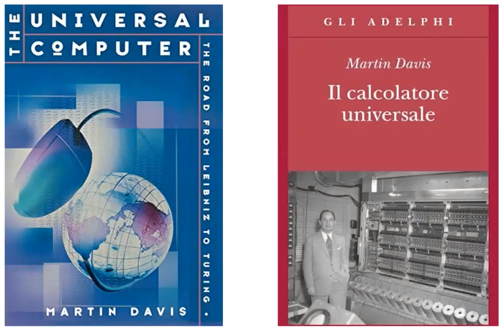
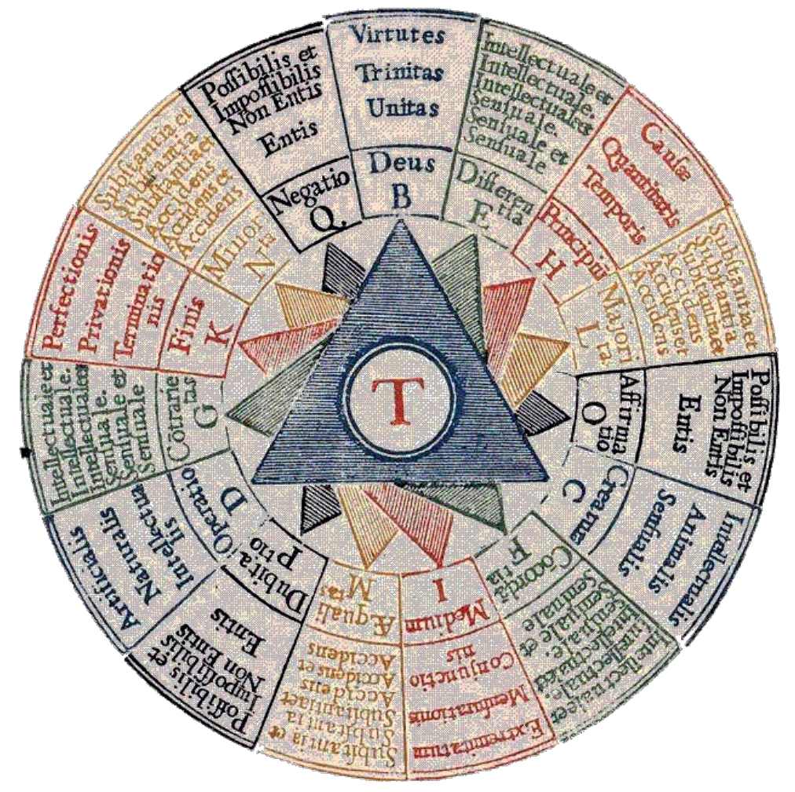
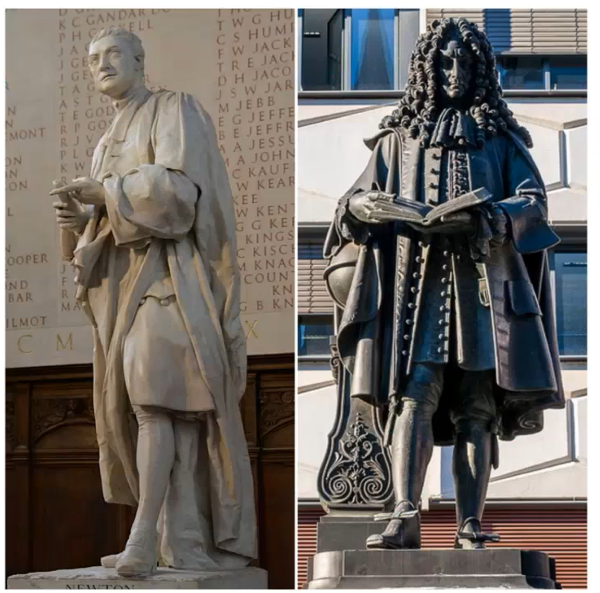
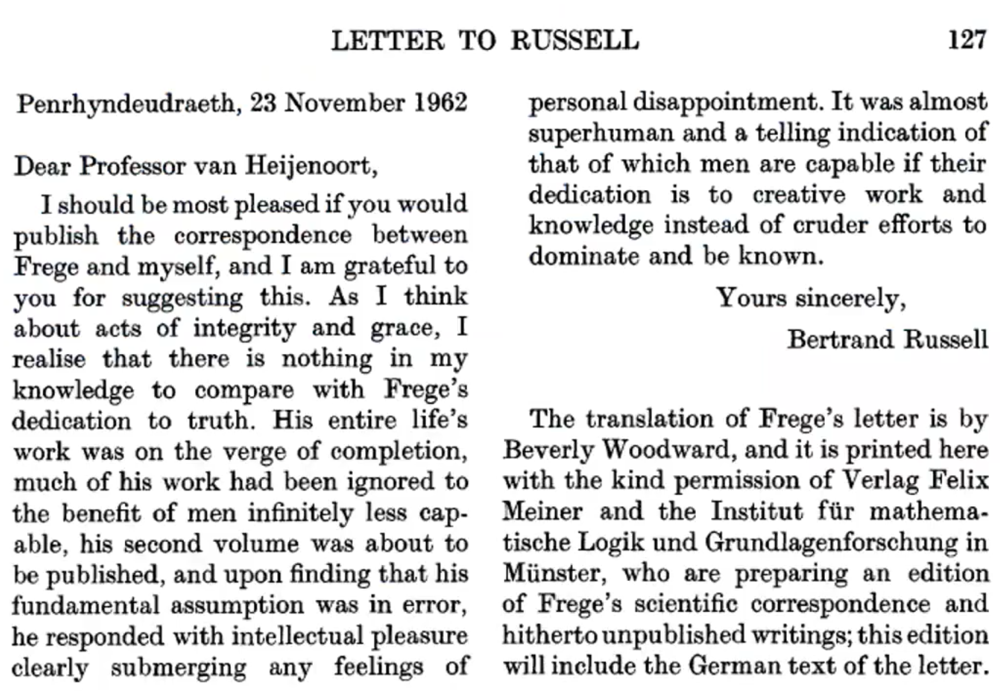
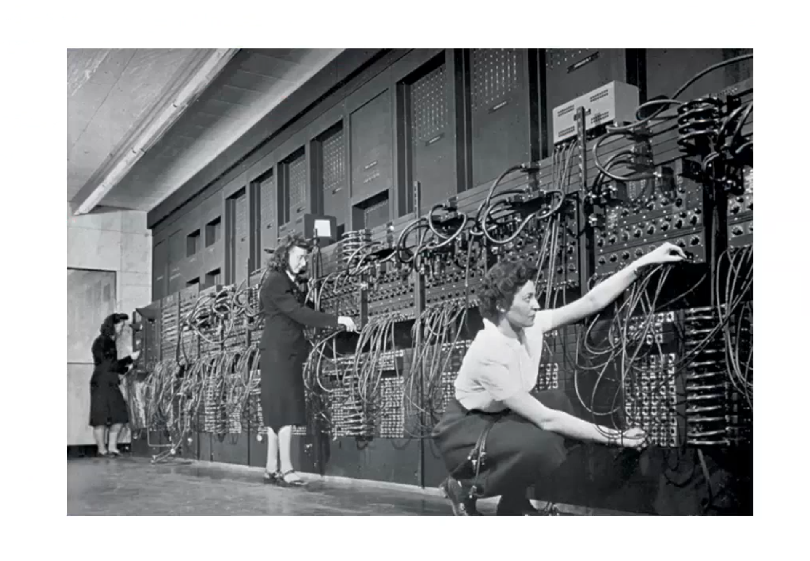

# The Universal Computer: The Road from Leibniz to Turing

Computer Science has its roots in various fields such as philosophy, mathematics, and logic. 

Discipline with a theory, an experimental method, and engineering (different from natural sciences that are separated from their engineering sciences). Constant exchange between the scientific paradigm and the engineering one

Computer science realizes and manipulates non-physical models. 

Three faces of CS: 

- CS as a mathematical discipline: Programs are mathematical entities subject to purely deductive reasoning, which originates from mathematical logic and is analyzed through formal methods.
- CS as a engineering discipline: The 1970s saw a shift in focus in computer science from proving program correctness to managing system complexity and evaluating reliability, with an emphasis on producing artifacts.
- CS as a scientific discipline: both formal methods and empirical testing are used, involving deductive and inductive probabilistic reasoning.

## Reasoning 

One often-overlooked aspect of computing history is the attempt to find a way to represent reasoning. This is significant because reasoning has long been regarded as a distinctive human characteristic. 

### Raymond Roule 

Raymond Roule, a philosopher from Spain, created a primitive method of knowledge representation known as Ars Magna, which aimed to produce new knowledge using symbols and numbers. The machine was not just a way of representing information, but also a tool for generating new knowledge. Roule called it "a technique to find new truth," or "ars inveniendi veritatem." 
Although it is uncertain whether the machine was ever built or how it was used in practice, this primitive knowledge representation system laid the groundwork for the development of computing and the idea of representing and reasoning on knowledge.

{width=50%} 

### Pascal 

Pascal invented the **first mechanical calculator** but it's important to understand that this mechanical calculator (at least at the beginning) was not invented for practical reasons.

This is a key point: the mechanical calculator was just invented as a kind of game and for fun during parties or kind of recreational contexts.

The purpose of exploring the idea of delegating calculations to machines was not to prove their ability to replace human workers, but rather to approach the concept from a more theoretical standpoint. The question was whether something that was traditionally considered to be a uniquely human activity, such as performing calculations, could be delegated to a machine. This conceptual attitude has been applied in various contexts, including modern times.

You can see that still today we are exactly doing the same in the context in which we live.. (chatGpt and Dalle etc. etc). 
Of course then there are also many worries about the consequences of introducing tools like this in everyday activities but there is always the same line of thought: the kind of surprise that we human beings have with respect to the possibility that machines can do something that we did believe that was just only possible for humans. 
While in the 17th century, a simple mechanical calculator was used, today there are sophisticated forms of AI tools that can answer questions, compose poetry, and even write philosophical essays. However, it is important to note that this was not initially designed to solve practical problems. 

### Hobbes

Thomas Hobbes, a philosopher of nature, introduced the idea of reasoning as a means of combining representations. This concept aligns with the tradition of Raymond Lune. Despite being well known as a political philosopher, Hobbes contributions to conceptualizing reasoning as a way of combining different representations is also significant and relevant to our studies.

### Leibniz's dream 

Leibniz has been the first one in the modern history to emphasize that reasoning is a form of calculus.This today is labeled as **computationalism**: many people, philosophers, scholars and computer scientists think that reasoning and intelligence is a form of computation.

The original idea was let's find a way to represent knowledge: with logic. 
Logic is a useful tool for automatic reduction and **inference**, allowing for the preservation of truth in starting points (the knowledge base). The use of logic is necessary to ensure **unambiguous** and expressive language.

**Leibniz's dream** was not possible to be achieved. The reason for this was that logic was not formalized enough at the time. Aristotle and other Greek philosophers invented the idea of logic but it was not formalized.
Leibniz had an ambitious project, which is a famous quotation: **"Philosophers as calculators"**. He believed that reasoning is not more than a calculus, and **all controversies could be solved** by means of calculations, without any kind of subjective discussions. Calculations are objective and have no subjectivity, and numbers can be understood by anybody in the same way. This approach can resolve controversies in a definite way.

Probably this idea was reflection of personal problems: Newton-Leibniz Calculus Controversy (who got there first?). Leibniz immediately saw the problem of having a good representation of knowledge.
{width=55%}

### Babbage

Charles Babbage was a mathematician and engineer in 19th century England who saw the potential for machines to perform calculations and eliminate human errors and fatigue. He envisioned the analytical machine, but financial support was lacking and it was never built.

Boole took a step towards algebrization of logic, but Frege(1876)'s idea of a formal system. He spent his life analyzing this problem and dreamed of adapting mathematics to logic. 
Finding the conceptual foundations of mathematics is the key point, which Turing also had in mind, but it was a philosophical problem.
In 1893, he published a reduction of mathematics to logic. 
However, his work received a critical response from a young mathematician named Bertrand Russell.

Russell's antinomy from Wikipedia: Most sets commonly encountered are not members of themselves. For example, consider the set of all squares in a plane Plane. This set is not itself a square in the plane, thus it is not a member of itself. Let us call a set "normal" if it is not a member of itself, and "abnormal" if it is a member of itself. Clearly every set must be either normal or abnormal. The set of squares in the plane is normal. In contrast, the complementary set that contains everything which is **not** a square in the plane is itself not a square in the plane, and so it is one of its own members and is therefore abnormal.
Now we consider the set of all normal sets, _R_, and try to determine whether _R_ is normal or abnormal. If _R_ were normal, it would be contained in the set of all normal sets (itself), and therefore be abnormal; on the other hand if _R_ were abnormal, it would not be contained in the set of all normal sets (itself), and therefore be normal. This leads to the conclusion that _R_ is neither normal nor abnormal: Russell's paradox.
Russell also showed that a version of the paradox could be derived in the axiomatic system constructed by Frege, hence destroying Frege's attempt to reduce mathematics to logic.

> " Let's imagine you're in the process of publishing the book of your life. You've spent years of hard work on this book, and you're a well-known figure in your field. One day, you receive a letter from a young person you've never met, who provides feedback that completely destroy your understanding of your work. While most of us might dismiss such feedback but Frege was dedicated to the pursuit of truth, and even when his entire life's work was on the verge of completion, he was willing to accept the possibility that he may have been wrong. "

In fact, when he discovered that his fundamental assumption was in error just as his second volume was about to be published, Frege responded with a level of intellectual honesty that was almost superhuman. He didn't let personal disappointment or feelings of failure overcome him, but rather submerged them with a dedication to knowledge and creative work. 

Frege even added a section to the very end of the book, acknowledging the possibility that his work might be wrong. This was not entirely true, as Frege's work was foundational in the field of mathematics in the early 20th century, and many others were building on his theoretical framework to solve problems of continuity.

### From Hilbert to Turing

The problem mathematicians were working to solve was finding strong concepts and ideas at the basis of mathematics. Hilbert program was to use axioms as formal foundations of mathematics. The problem was to find a mechanical procedure to decide if a formula can be derived from the axioms in a logical calculus. 
The concept of mechanical process needs to be conceived in a precise and rigorous way, here comes the Turing Machine.
The Turing's paper was published in the philosophical journal "Mind" and served as a formal definition of algebra. Other mathematicians, such as Church and Von Neumann, provided equivalent formalizations.

