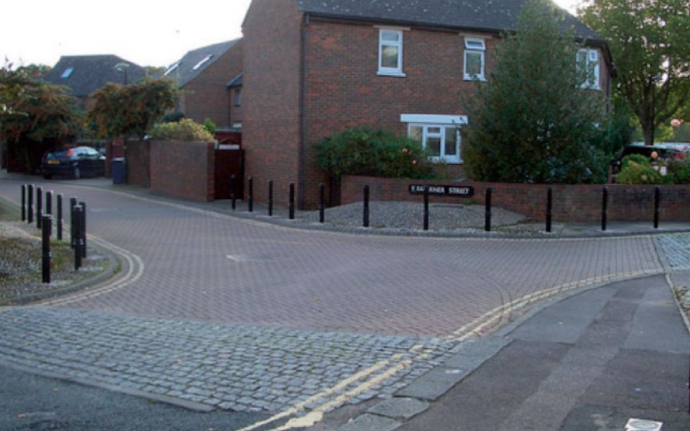

We have to start from computation.

# Intuitive perspective

Computation derives from the Latin 'com-putare' which means 'to determine or to calculate especially by mathematical means'.

Finite set of instructions, which operate on certain
entities (symbols, representations of numbers, etc.)
and can be implemented in some mechanism
-To execute an algorithm means to have the
mechanism to carry out the instructions for any given
input in a deterministic, discrete, stepwise fashion
-The mechanism goes through a sequence of atomic
steps in such a way that (one or more of) these steps
correspond to some instruction, for all the
instructions specified by the algorithm

Algorithmic specification will take different forms
(depending on the kind of mechanism)
-In the case of computers it is expressed as a
programming language
-In the case of humans instructions may be given in
ordinary language (individual steps must be clearly
distinguishable and described with sufficient precision)
The concept of algorithm is tightly connected to that of
mechanically realizable processes
-What is a mechanism
-Precise specification of the notion of algorithm

# Historical perspective

Philosophers have been always analyzing the possibility to realize mechanical systems to help humans making calculations

From the beginning computation is connected to the idea of mechanically manipulated representations 

 These ideas are formally developed during XX century
and are concretely applied in the construction of the
first electronic calculators developed starting from
1940s
-Major progresses in the construction of computers
and the conception of computing are due to two
independent developments
-The logical analysis of the notions formal system and
formal proof (leading to further studies of notions as
effectively computable function and algorithm)
-The rapid progression in the engineering of electronic
components

In the 1930s logicians start working for a well-defined
formal notion of computation in order to make the
intuitive notion of computation formally precise
-They focus on the class of functions that can be
effectively calculated in principle (being logicians
and digital computers not existing yet)
-Mathematician Alonzo Church (1936) is the first to
give this class of effective calculable functions a
formal characterization through a definition
postulate
-In the same year Alan Turing introduces his
machine model to define
-A notion of effective procedure or algorithm
-A notion of function computed by an algorithm

# Philosophical perspective

In the 1930s logicians start working for a well-defined formal notion of computation in order to make the intuitive notion of computation formally precise -They focus on the class of functions that can be effectively calculated in principle (being logicians and digital computers not existing yet)

An algorithm is the gate, a finite method to reach a goal, so it's an effective procedure and a notion of function computed by an algorithm.

Turing 1936

The idea of a Turing machine, this is what Turing did.

And an algorithm for a given problem, so you have to, in the case of algorithm, to reach a goal, if you have a problem, and in this case, the algorithm can be characterized as a final procedure to solve that problem, such that, first of all, this algorithm is not ambiguous.

And here, according to Turing, not be ambiguous for both the computer, the digital computer, this will be clarified later, and the human being, the algorithm is effective.

So it must terminate and give back a correct solution to the problem.

And I would say that it's effective and also composes all the finite numbers of steps.

It was very clear that the Turing machine is a model of a human while making calculations.

And let me mention five major constraints that Turing outlines in this paper and are at the core of his notion of algorithm.

Five major constraints for doing automatic computations
1. Only a finite number of symbols can be written down and
used in any computation
2. There is a fixed bound on the amount of scratch paper
(and the symbols on it) that a human can take in at a time in
order to decide what to do next
3. At any time a symbol can be written down or erased (in a
certain area on the scratch paper called 'cell')
4. There is a upper limit to the distance between cells that can
be considered in two consecutives computational steps
5. There is an upper bound to the number of states of mind a
human can be in, and the current state of mind together with
the last symbol written or erased determine what to do next

But then again here the comparison with the human computer reappears and it's a little bit, or at least it seems a bit misleading.
But please always remember that the inspiration of this model is the human computer, okay? So if you have in mind these sort of inspiration, I think these steps can become clear.

So what about the model of this computation? Of course this is a mathematical model and it's a mathematical model.
Why mathematical? Because it's expressed with the language of mathematics in this case.

And it's a mathematical model of a mechanical device that satisfies constraints 1, 2, 3, 4 and 5, okay? But then at the same time it's also a sort of idealized model of human computing.
Why is it idealized in this sense? Why am I stressing that? I just told you that it is a model of a human making calculations.

So errors are not contemplated and indeed we have seen, I was discussing how to divide to conceal primitive computers was a way to avoid human errors.

Is this kind of model a way of expressing the essence of humans? 

Mathematical model of an imagined mechanical
device satisfying conditions 1-5
-Idealized model of human computing since it could
process and store arbitrarily long, finite sequences of
symbols
-Abstract model since it only captures high-level
processes that take place in humans when they
compute (as opposed to low-level neuronal processes,
for example)

Any function computable by a human being
following fixed rules can be computed by a Turing
machine
-Every function computed by a Turing machine could
(in principle) be computed by a human computer
-This equivalence does not preclude humans from being
able to find answers to problems which no Turing
machine can compute (for example using intuition)

Finite set of instructions, which operate on certain
entities (symbols, representations of numbers, etc.)
and can be implemented in some mechanism
-To execute an algorithm means to have the
mechanism to carry out the instructions for any given
input in a deterministic, discrete, stepwise fashion
-The mechanism goes through a sequence of atomic
steps in such a way that (one or more of) these steps
correspond to some instruction, for all the
instructions specified by the algorithm

So the goal is to move from a purely formal definition to a more general idea for algorithm.

---

A not quite random walk

explores the relationship between algorithms and human decision-making. The author argues that reasoning with algorithms is not as straightforward or intuitive as usually depicted, and ambiguity is a key element that needs to be considered. The article also discusses the iterative and experimental process of fine-tuning algorithms to unanticipated circumstances to increase their robustness.

Furthermore, the article highlights the differences between the algorithm and the practices of observation, negotiation, and decision-making, which can result in ethical issues not accounted for in the algorithm. The author argues that while algorithms can be more efficient than humans, they should not be viewed as an ultimate solution to problems of efficiency.

Overall, the article provides insights into the complexity of human-algorithm interaction and suggests the importance of a more nuanced understanding of algorithms in practice.

And here I guess that one of the results of this paper and this sort of experimentation, the so-called algorithmic work, is the idea to show that reasoning with algorithm is complex and it's sometimes an ambiguous exercise, okay? And we focus on ambiguity.

---

Ziewitz, M. (2017). A not quite random walk: Experimenting with
the ethnomethods of the algorithm. Big Data & Society, 4(2).
https://doi.org/10.1177/2053951717738105 <- check it / read it 

And here in particular this paper describes an algorithmic work in which two people, the author and a colleague, have to work together in Oxford, UK, and the paper describes five stops.

And these five stops of this work are way of evidencing some problems of the algorithmic process and the use of the algorithmic process in this case.

The challenge for participants is to take a walk while navigating algorithmically within certain constraints. The goal is to produce five stops along the way. The experiment is organized in a way that allows problems to emerge, with difficulties serving as an important resource for understanding reasoning with algorithms.

And the first problem is that at the beginning, it's not clear what the problem is.

So what you would like to have this algorithm for? What? What is the goal? What is the goal that you want to reach by means of this algorithm? And this is not clear.

To properly decide on the initial set of instructions, the following steps should be considered:

-   Establish a set of rules that are specific enough to generate clear directions yet general enough to be applicable in any situation.
-   Clarify the ultimate goal of the instructions.
-   Articulate a problem, such as the need to explore new parts of the city, as a requirement for algorithmic processing.
-   Only after posing the problem, proceed to produce the necessary directions.

--- 

Let's consider the second stop now. enactment 
The second stop on the algorithmic navigation challenge is significant because it highlights the problem of ambiguit

Enactment is the process of applying rules not only in theory but also in the specific circumstances of their use. It involves recasting our observations to fit the grammar of the initial statements.

The rules are decided by the algorithm and specified clearly. However, the rules must not only be applied but enacted in practice. This is the second problem that arises, and it is interesting to analyze because it highlights the need to not only have abstract rules but to also specify and enact them in practice. In essence, enactment involves applying the rules in a specific context and situation, allowing for a more nuanced understanding of their application.

> At any junction, take the least familiar road.  
> Take turns in assessing familiarity.
> If all roads are equally familiar, go straight.
> It is only a road if you can walk a bike on it.

What is a junction? What is a road?

--- 

Third step - avoiding responsibility 

The algorithm is used to recast the situation through statements such as "our algorithm," allowing individuals to avoid taking individual responsibility and hide behind a seemingly autonomous operation. While this may seem like an easy way out, it is important to remember that algorithms are not infallible and can have biases or limitations that can affect their decisions. Therefore, it is crucial to remain aware of the role algorithms play in decision-making and to take responsibility for the choices made, regardless of the algorithm's involvement.

The use of algorithms as a way to de-responsibilize individuals is an interesting phenomenon. By adopting an algorithmic process, people can avoid taking responsibility for their choices, as the algorithm becomes the decision-maker. This is powerful because it removes the individual's choice and places it solely in the hands of the algorithm. While the example given may seem simple, this is a common occurrence in our daily lives. Many decisions are made based on algorithms, and this can be seen as a way of avoiding responsibility and conflict, which are essential elements of any political decision.

---

stop four. increasing robustness

hat does "straight" mean in this context? This ambiguity highlights the need for fine-tuning algorithms when reasoning with them. To increase the algorithm's robustness, fine-tuning is an essential process. It allows the algorithm to adapt to unanticipated circumstances and function better.

In essence, the process of increasing the robustness of the algorithm involves fine-tuning it to ensure that it is effective in various contexts. This is crucial when reasoning with algorithms because they can have limitations or biases that need to be addressed. Therefore, by fine-tuning the algorithm, we can increase its robustness and improve the overall effectiveness of our walk.

---

fifth and last step 

When using algorithms, normativity and ethics play an essential role. For instance, in this case, this bad designed algorithms do not account for the possibility of private property. While this ethical consideration is not coded into the algorithm, it can still be achieved through collective reasoning.

In other words, algorithms may not always take into account ethical considerations or norms that are crucial in certain contexts.  the role of normativity and ethics is vital in reasoning with algorithms. While algorithms can provide valuable guidance and direction, they do not always account for the full range of ethical considerations that are important in decision-making. Therefore, collective reasoning plays a crucial role in ensuring that our actions align with ethical principles and norms.

--- 

Reasoning with algorithm as not straightforward or intuitive as usually depicted:
The author argues that reasoning with algorithms is not as straightforward or intuitive as usually depicted, using the example of recipes. Despite being an intuitive idea of algorithms, the details show that it is not easy to reason with algorithms. Ambiguity is a key element, and historical attempts have been made to eliminate it. Reasoning with algorithms is an iterative and experimental process.

-   Recipe is often used as an intuitive idea of algorithm, but looking into the details shows it's not easy.
-   Ambiguity is a key element, which historical attempts to eliminate.
-   Algorithms should not only be known in theory but also used in practice.Reasoning with algorithm is an iterative and experimental process.

While algorithms can be more efficient than humans, efficiency is just one part of the story. Algorithms do not account for ethics or private property, which are achieved through collective reasoning.

