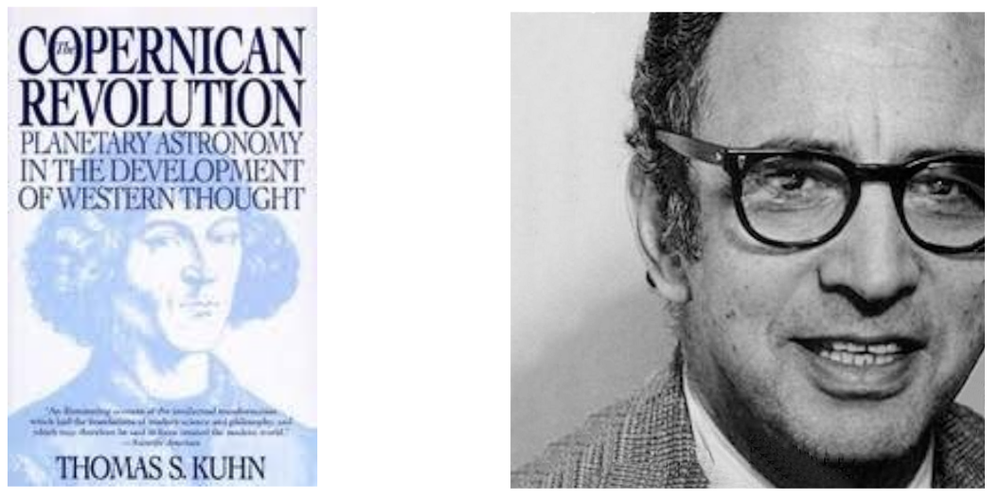
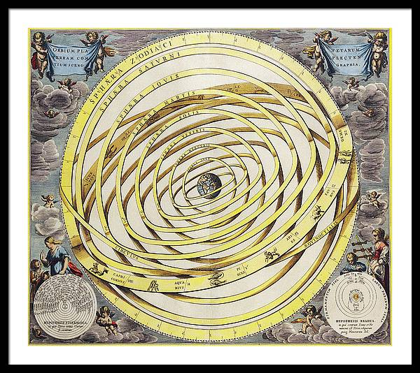
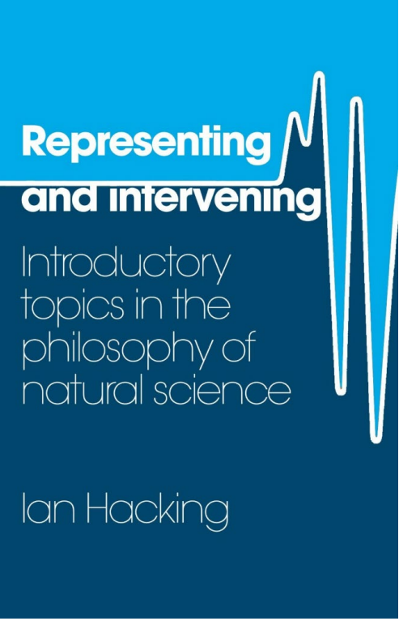

# Philosophical and historical analysis of science, technology, and engineering

## Computer science as a scientific discipline?

What computer science is? It is science or a branch of mathematics or it is engineering and software?

But there are many gray areas, the boundaries of what constitutes an experiment in different fields, such as mathematics and economics, are not well-defined. While mathematics does not make use of experimentation, it is still considered a science because it can provide proof without the need for experimentation. Economics is also considered a science due to its mathematical basis, although the study of human behavior in economics may be less scientific. 

Which kinds of activity count as science?

A scientific theory needs to rely on natural evidence or if it can be based solely on theory? As in the case of Charles Darwin's "Origin of Species," which does not make use of mathematics.

The definition of science and what constitutes an experiment can be a slippery concept, and references a book by Galileo, which is considered a milestone in the scientific revolution despite not containing any mathematical formulas.

How does science work?

- Empiricism: Empiricism as a source of knowledge; Science and empiricism; Limits of empirical tests; Experience over reasoning.
- Mathematics: Empiricism as a source of knowledge; Science and empiricism; Limits of empirical tests; Experience over reasoning.
- Social structure and science: Science's success stems from its unique social structure of elaborate networks of cooperation and trust, a balance of cooperation and competition, and new ways of policing and coordinating groups of people in research.

## Scientific revolutions

Scientific revolutions as ways to evidence some features of  
science

### Kuhn’s The Copernican Revolution (1957)

{width=50%}

Thomas Kuhn, "The Structure of Scientific Revolution," which discusses the Copernican Revolution and its significance in the history of science. 

Kuhn's book provides a valuable framework for understanding these revolutions and the social, cultural, and political factors that shape scientific knowledge.

Starting from astronomy and ending in physics

In his 1957 book, "The Copernican Revolution: Planetary Astronomy in the Development of Western Thought," Thomas Kuhn explores the impact of the Copernican revolution on the development of Western thought. Kuhn argues that the Copernican revolution, which replaced the Earth-centered Ptolemaic system with the sun-centered Copernican system, was not just a scientific revolution but also a paradigm shift that fundamentally altered the way people viewed the world. He explores how the Copernican revolution challenged the dominant Aristotelian worldview and paved the way for modern science. Kuhn also examines the social and cultural context of the Copernican revolution and how it was received by the scientific community and society at large. The book is considered a landmark in the history and philosophy of science, and Kuhn's concept of scientific paradigms has had a significant influence on subsequent scholarship in the field.

### Ptolemy

Aristotelian but dominated  
by mathematical precision

Proliferating complexity  
(Copernicus’ monster)

Designed to precisely explain  
planetary motions

{width=50%}

Ptolemy later provided a precise and mathematically powerful model of the universe based on Greek philosophy and culture (it was an Aristotelian model) where the most perfect bodies were considered those that did not move, and any movement was seen as imperfect. Greeks believed that uniform circular motion was the closest to perfection, and this belief played a major role in astronomy. They had a model that explained celestial motion as uniformly circular, but this did not explain some planetary movements. 
The Ptolemaic system was based on mathematical precision, it worked very well but it was very complex. 

Copernicus and other astronomers, provided a simpler and more elegant explanation for celestial motion. 
Despite the strong opposition from the Catholic Church and others, the heliocentric theory gradually gained acceptance, and it paved the way for other scientific revolutions that transformed our understanding of the world and the universe. 

The Copernican Revolution marked a paradigm shift in the history of science, leading to a transformation in theory, methods, practices, and instrumentation, and it also had important social implications. 

### Copernicus

First detailed theory with the earth moving around the sun  
(heliostaticism)

{width=50%}

The Copernican Revolution challenged the Ptolemaic system. 

In the early modern period, Copernicanism revolutionized our understanding of the universe by presenting the idea that the sun, rather than the Earth, was the center of the solar system. However, it was not only the shift in perspective that made Copernicanism such a significant development, but also the emphasis placed on finding mathematical harmony in the heavens, which was inspired by the philosophical school of Neoplatonism.

Neoplatonism emphasized the idea of simplicity and mathematics as the foundations of the universe. This perspective was rooted in the ancient philosopher Plato's ideas about the existence of abstract mathematical concepts as the ultimate reality, and was revived during the Renaissance as part of a broader fascination with classical thought.

This focus on mathematical harmony led to the discovery of the elliptical orbits of planets and the formulation of the three laws of planetary motion by Johannes Kepler. These laws, which described the mathematical relationships between the movements of planets, allowed for a massive simplification of the understanding of the cosmos, and improved the accuracy of predictions about planetary motion.

The emphasis on simplicity and mathematical harmony in the study of the heavens reflected a broader trend in early modern science towards the use of mathematics as a tool for understanding the natural world. By relying on mathematical principles to describe the physical world, early modern scientists believed they could uncover deeper truths about the universe.

### Kepler's Astronomia Nova (1609)

Copernicanism combined with  
obsession in finding  
mathematical harmony in the  
structure of the heavens  
(neoplatonism)

Massive simplification and  
better predictive accuracy

In conclusion, the combination of Copernicanism with the obsession of finding mathematical harmony in the heavens was a crucial development in the history of science. This approach was rooted in the philosophical ideas of Neoplatonism, which emphasized the importance of simplicity and mathematics in understanding the universe. The discovery of the elliptical orbits and the formulation of Kepler's laws marked a significant shift towards the use of mathematics as a tool for understanding the natural world. The focus on mathematical principles continues to be a central feature of scientific inquiry today.

### Galilei’s Sidereus Nuncius (1609-10)

Use of the telescope to observe the heavens

**Observation** of a multitude of phenomena contradicting  
Aristotle’s view of the world (no supralunar and sublunar  
distinction)

Need to have a new science to solve definitively some  
astronomic problems (e.g. planets motion)

The use of the telescope to observe the heavens marked a major turning point in the history of science. This breakthrough allowed astronomers to observe a multitude of phenomena that contradicted the Aristotelian view of the world. For instance, according to Aristotle and Ptolemy, celestial bodies were perfect spheres, but observations with the telescope revealed otherwise. The moon, for example, was observed to have holes and craters, indicating that it was not perfect as previously believed.

Another significant observation made with the telescope was the existence of subtle lights on planets like Jupiter, which were previously not visible to the naked eye. This observation challenged the idea that the earth was the center of the universe, as it was previously believed that the earth was the only celestial body with a subtle light - the moon. Furthermore, Galileo's observations of sunsets and sunrises on the moon showed that the same processes and phenomena occurred on the moon as they did on earth. This discovery undermined the Aristotelian view of a clear distinction between supralunar and sublunar regions.

The use of the telescope led to a revolution in astronomy and challenged the traditional ideas of the universe's structure. It prompted the need for a new science that could explain definitively some astronomical problems, such as the motion of planets. The observations made with the telescope marked a shift from relying on theoretical speculation to empirical evidence, which became the hallmark of modern science.

Overall, the use of the telescope to observe the heavens allowed for a deeper understanding of the universe's structure and function, and led to the development of new theories that continue to influence scientific thought to this day. The telescope remains a vital tool in modern astronomy, and its continued use promises to reveal even more about the mysteries of the universe.

Mathematics is a key part of science and one of the three major answers to the question of how science works. The idea is that mathematics provides a precise and logical language that allows scientists to make accurate predictions and test their theories. This approach is often associated with the work of Galileo and Newton, who used mathematical models to explain physical phenomena. However, the book also notes that mathematics alone cannot fully capture the complexity of natural phenomena, and that empirical observation and experimentation are still necessary.

---

06 - 03 

We restart from Kepler's Astronomia Nova (1609) 

Galileo stuff

So probably in the Ilium Massimi Systemi, there are the two main systems.

Of course, the Copernican one and the Aristotelian-Ptolemaic one.

But what about dialogue? Why is the third dialogue important? 

there are three people.

And we see also that probably this idea of the dialogue is a way to mitigate some of the strong claims.

There's another reason.
Plato's books were rediscovered in the 15th century, more or less.
basically almost these books were in the form of a dialogue.
This is a book in this line of thought.
The author of this book is a neo-Platonic.

So this is the book in which we can clearly see the movement from the astronomical revolution to the scientific one.

It is a book starting from the same old problems of the planet that, in a sense, was already solved by Kepler's Astronomy and Nova, but was solved in mathematical terms.

And from a methodological point of view, it's very important, it's very interesting that this book combines some empirical methods and some mathematical ones.

This is very peculiar of the birth of scientific revolution.

So here, the most important message is that the scientific revolution does not start just by means of observations.

And I want to stress this point, because sometimes in schools, in some books, you can find, okay, that science, modern science starts because people decided to observe, to collect observations, to collect data, and then try to generalize them.

It's exactly the contrary, in a sense.

And I will show you this in a minute.

Data can be very misleading.

So data needs to be interpretive.

That's a very important point.

And in a sense, if we want to go back to Aristotle, who was in a sense the critical point of attack for many of these natural philosophers, Aristotle founded a science that was based on data, on observations.

Aristotle was a very good observer, and he wrote many books collecting observations.
But here, observations are not enough.

And the three people in the book are Salviati, Simplicio, and Salvato.

So you can see immediately that Simplicio, that means simple, it has the same roots as simple, is the representative of the Aristotelian view.

Okay? While Salviati is like the representative of the European view, and Salvato is like the person asking questions and trying to balance between the two other characters.

But it's very clear not only from the name, but also from what Simplicio does in the book that Galileo has a very poor esteem of Simplicio's positions and of his attitudes.

Okay? So another important element is that Simplicio is the representative of the Aristotelian view.

But Galileo is not against Aristotle as a philosopher.

Galileo recognizes that Aristotle really was a brilliant philosopher and also he did a very good job.

What is the point of attack for Galileo are what he labeled, he and others labeled, the Aristotelians.

So all those philosophers of natures and scholars that were just following Aristotle and just spending their life, as Galileo says, not in the study of the nature, but in the study of the books.

So here there is a strong interposition between the kind of philosopher of nature that is made just by reading and commenting on the Aristotelians.
This is a key point.
It's a tricky point and I will tell you something more.
This is the point of attack to the principle of authority.

The role of observation.

So the role of observation sometimes has been recognized as a central point for the study of the astronomical revolution.
Here Galileo is very clear that observation can be misleading.
He provides a very many examples, but a very clear example that is well discussed in the book, that is how observation, how direct perception of phenomena can fool us.

And a very clear example is the fact that, in a sense, he needs to explain why we do not perceive.

He is claiming, in a cornerswithing, a vertical view, that Earth is moving.
One immediate criticism presided by Galileo and others is, how is it possible we do not perceive this movement? 
So this theory, the idea of the Copernican idea of the universe, contradicts our everyday experience.

This contradiction between experience/observations and theory is something that we have met already with the problem of the planets, the ancient astronomy, and the solution by using epicycles and deference, and the idea that it's better to say the theory rather than to just accept observations without any interpretation.

Galileo answers to this problem.

And he does by means of reason.

We need to take data and interpret them.

We can interpret them when we have like a theoretical framework that can help us in this interpretation.

Galileo uses the famous ship experiment, one of the key moments of the book since it says that in this case using observations and experience the answer is not correct.

He is telling that to make the real experience is the key point, because the real experience will show us that basically the stone is not interested by the movement of the ship.

Galilean relativity is basically can make sense of these and other experiences.

---

Skip to Newton.

Newton embrace neoplatonism, but also another philosophical view.

The importance of mathematics.

Why mathematics? Because so far we have seen that mathematics is the language of science, is the new language of science.

But the reason why mathematics is the new language of science is not just because it works very well.

It's not just for practical reasons.
The reason is philosophical.

Newton's Principia (1687) book , focusing on some philosophical elements of this discussion.

Newton's view is a combination of both Neoplatonic and mechanisms position.

And the idea is that the universe is composed of tiny bodies that can interact only by physical contacts. This is a form of mechanisms.

Principia Mathematica, Newton states something that in a sense is contradicted by the facts.

Unified mathematical treatment of  
motion both on earth and on heavens  
 Newton showed why Kepler’s elliptical  
orbits were the inevitable outcome of  
the force of gravity operating between  
heavenly bodies  
 Combination of Copernicanism and a  
form of mechanicism (world made  
up of tiny “corpuscles” of matter  
interacting only by local physical  
contact)  
 Newton’s physics as the combination of  
the mechanical worldview and of a  
post-mechanical view  
 Some forces (gravity most  
importantly) are posited and not  
interpretable in mechanical terms  
 Hypotheses non fingo  
Newton’s Principia (1687)

Philosophical Issues of CS  
10  
 At the end of Scientific Revolution no separation between  
theory and practice  
 Virtuous relationship between the invention of new  
(microscope) or better (telescope) instruments and the  
progression of sciences (optics)  
 Technical knowledge is precise (as theoretical knowledge)  
and guided by precise theoretical principles and laws  
 Increasing importance of applicative and engineering  
sciences within society  
 Engineering scientists

Goals of science

Description: 
	- Collection of data  
	- Is complete description enough for a scientific account?  
- Prediction  
	- Effort to know about the future  
	- Is a list of past, present, and future facts enough?  
- Control  
	- Not just predicting, but intervening on the future  
	- Preventing and taking care of diseases  
- Organization  
	- Interest in regularities and organizations of facts  
- Explanation  
	- Not just description, but reasons (how and why)  
	- Connection between explanation and prediction

Prediction comment: 

how for at least one century, the Ptolemaic Aristotelian system was providing better predictions than the Copernican one.
So this is just to tell you that you have been raised like in a sense in this context to think that, for example, the fact that the system works and works well is a sign of the fact that it provides a real description, a good description, a true description of a phenomenon.
A good point just to move beyond practical results and practical elements.
We see a situation in which modern science was born not because one system was working better than another, it was providing better predictions than another.
Sometimes to have something that works better, you need also to have different concepts, different ideas.

Control comment: 

So you don't want just to make good predictions, but in some cases like in medicine, but also in engineering, you want to control something.

Like, for example, in the case of disease, hopefully you want, of course, to predict the disease is very important, but also to control it is a key element.

And the same in the case of engineering to predict some phenomena, but also to control them and to use like technological architectures to put this control in practice.

Organization comments 

Why is focus on regularities on organizing facts? Rather than the focus on the single case.

The idea that you want in science universal laws, why universal laws? The idea is like in the case of Newton, for example.

The law of variation is universal in the sense that can face that comprehend family different phenomena.

--- 

# Second part of the lecture on papers that say that Computer Science is a science. 

The history, we have seen, starts from mathematics.
So in a sense, it took some years to develop in an independent way from mathematics.

Computer science employs formal methods, but also empirical methods and empirical testing play a very important role.

But what about explanation? So we ended the part on the goals of science by emphasizing that explanation plays a major role in science.
In our general view, that computer science tries to explain how information works.

So not like models used for a particular task, but information in general.

OK, so in a sense, you agree that computer science deals with explanation, but it's not explanation of specific technologies or specific techniques, but explanation with respect to a more abstract and general concept that is information.
We see a paper mentioning this part.

Explanation of machine Behavior

The profession of IT computing: the fourth great domain of science 
book. From slides:

> Computing does not seem to fit nicely into any of the traditional domains. Computation is realized in physical media and is even part of some physical processes (for example, quantum mechanical waves). More recently computation has been found in living systems (for example, DNA transcription) and social systems (for example, evolution of scale-free networks). Although computational methods are used extensively in all the domains, none studies computation per se—computation is not a physical effect, a living entity, or a social entity...

--- 

09 - 03 

We will focus today on technology and on technology and engineering.

The definition of technology and its relationship with science.

The traditional view of technology that is called the instrumental view of technology.
This is the traditional view.
So technology, according to this view, is the systematic application of scientific or any other knowledge.
Okay, it's not just tools and machines.

But let's now see what is a more current idea of technology than of its relationship with science, the sort of new way in the conceptualization of technology.
Key concept is the concept of technical artifacts and artifact based services.
So the focus shift from tools, machines to the design process, which is a complex process.

Technology has a sort of independence from science.
At least from a conceptual point of view.

So the key notion of intervention would be important today and next lecture.

We want to have we want to manipulate the world in which we live to adapt this world to our needs.

And this is something that I think nobody can deny in a sense.
In the sense of the traditional idea of progress to try to improve human lives and stuff like this, but also in the sense of the problems that we have today in terms of sustainability and stuff like this.
Also such radical changes that make today that raise many problems and make the under discussion is idea of evolution, this idea of intervention, this idea of control on the natural and social phenomena as well.
And these material objects, the material products of technologies are those labeled as technical artifacts.
OK, so technical artifacts and this definition of technical artifacts are material objects that have been produced by humans in a way.
So there is a intention in this production to fulfill some practical functions.

Here it's very important the relationship between technical function and technical artifacts.

So the technical artifact covers a technical function or a number of technical function.
Summary of the definition of technical artifacts.
So technical artifacts are physical objects, so they are something that is in the material, real of reality.
But they have a technical function and a use plan designed by human beings.

INSERT TECHNICAL ARTIFACTS HERE 

But they live in a complex structure.

And these complex structures are called socio-technical systems.

And this gives immediately the idea that these systems are composed both of technical artifacts and social elements.

Like, for example, all the problems with accessibility of technologies are usually managed by technical people, by engineers.
So that's why sometimes there are problems also of accessibility of some technologies and stuff like this.

...

Design process 

... from slides ... 

RECURRING ELEMENTS SLIDE 

What is engineering? What is its relationship with technology? Are technology and engineering the same, different, why? Engineering enables science whereas technology is sometimes created by engineering, which includes engineering in itself and in terms of its...

Let me move to the analysis of engineering, also from a philosophical and conceptual point of view.

And in a sense we can say, okay, so what about the relationship between technology and engineering? So we can say that technology, the development of technology, is a process that originates and is guided by the practice of engineering.

And so engineering is an activity that produces technologies, but has some features that are important to be considered.
Constraints, social constraints, life and safety, and stuff like this.
Monitoring constraints, time constraints, and stuff like this.

This is probably the first book that has been written by an engineer, and it is one of the first books to conceive the analysis of engineering from a philosophical point of view as carefully tuned to the practice of engineering.

But it's in line with the idea to look at the practice, not just to conceptualize only from a philosophical point of view.

Engineering is the creative application.
So it's not just the application, but the creative application.
Very creative of scientific principles to design or develop structures, machine apparatuses, manufacturing, processing and so on.
All aspects and intended function, economics of operation and safety, life and property.
So there is, of course, the technical artifacts and the emphasis on technical artifacts, creative application of scientific knowledge.

And here the idea is that there is a continuity between the engineering sciences and the natural sciences.

Engineering sciences, which is scientific research in the context of technological application, is an example of a science in the context of application.

But let me move to a hardly different notion of engineering and technoscientific knowledge.

science, engineering are not, let's say, separated.

- Technoscience is the fusion of theoretical representation and technical intervention, which cannot be separated even in theory. This constant interplay characterizes the research.
- Science and engineering cannot be separated. Technoscience is the product of this inseparable relationship, where theoretical and practical elements intertwine.
- In technoscience, theoretical and technical components are intertwined to such an extent that they cannot be separated - not even in theory.
- Technoscience is a research field that entails a constant interplay between theoretical representation and technical intervention, with neither element taking precedence over the other.
- Control, in this context, refers to the manipulation of the world to meet human needs.

Carl Mitcham, again an engineer, then turning to the philosophy of technology.
And he wrote this nice book, Thinking Through Technology.

And he mentioned engineering as a profession identified with the systematic knowledge of how to design useful archetypes or processes.
So systematicity plays a very important role.
And, of course, a discipline that includes some pure science and mathematics, but also the applied or engineering sciences and is directed toward some need or design.
So practical needs, practical goals play a very important element.

let's now go to the last part on on on computer engineering.

New species of engineering (Loui 1995)

This short paper is a paper that emphasizes that computer engineering is mostly engineering.
He reconstructs the idea that computer engineering is a new engineering discipline.
computer science is concerned with producing useful things, but also by considering some economic constraints, because in the end, the idea is to seek efficient solution to technical problems.

So let's move to the other paper that is longer.
Computer scientist as toolsmith (by Brooks)

Brooks advances the idea that computer science is a synthetic discipline.

And he says it is not a science or by the way, every time a discipline needs to use a science in its label, it's not a real science like physics.
This paper is that this is not just an analysis of the idea of synthetic.
It's the idea of something that does not create and study something that does not exist in nature.
Brooks emphasizes that these conceptual computer science as a science has a very strong impact from a practical point of view.

.... 

# 13 03 EXPERIMENTS 

Not a single, ‘well-defined’ method, but a collection of techniques, procedures, and methods for investigating the world is not a single, well-defined method. The scientific method is often used to differentiate natural sciences from mathematics, and its roots can be traced back to the XVII century Scientific Revolution. 

It is important to understand if computer science uses experiments in the same way as science.

Experimental methods allow us to observe aspects of nature that are otherwise hidden. We need to go beyond what is observed to understand nature. Experiments are a form of **controlled experience** that involve observations, actions, procedures, and processes in a controlled context.

Herschel (1831) claims that experience is the primary and ultimate source of knowledge regarding nature and its laws. There are two ways to acquire experience: 

- observation: it involves noting facts without attempting to influence their frequency or circumstances
- experimentation: it involves purposely varying causes and agents over which we have control and observing the resulting effects and noticing what effects take place.

Observing a drop of water through a microscope without any manipulation is not an experiment, while observing the same drop after coloring it with a reagent to detect microorganisms is experimental. **Experimentation** involves **controlling** certain aspects of a phenomenon under study and testing it under controlled conditions using instruments and tools. The **active manipulation** of variables is a key aspect of experimentation, along with documenting and determining findings. The **use of instruments** and tools is a classical feature of experimentation. Experiments create **controlled circumstances** and isolate the investigated phenomenon. Other factors are assumed to have no influence on the object under investigation. The selection of controlled factors is crucial for experiment success, which is why experiments are commonly performed in laboratories. 

In an experiment, the material world is manipulated under controlled conditions. The **independent variabl**e is changed or controlled to test its effects on the **dependent variable**, which is measured in the experiment.

The laboratory experiment is conducted with effective control and isolation of variables, while the field experiment is conducted in a natural environment where it's difficult to control extraneous variables. Both experiments manipulate independent variables, but **control is a theoretical concept** that cannot be fully achieved in practice.

### Purposes and properties

In science, experiments serve various purposes such as testing theories, choosing between rival hypotheses, verifying or falsifying hypotheses, concretely applying tested theories, improving instruments, and more. 
To ensure accuracy and universality of results, experiments should have some properties:

- **repeatable** at different times and in different places to ensure that the result is systematic and not due to chance.
- **reproducible** by other scientists: reproducibility is the ability to verify experiment results independently. 
- **comparison** with benchmarks different instances of the same experiment. Full documentation and sincerity in reporting anomalies and negative results is necessary.
- Adoption of **precise language** 
- Use of **precise measurements** help to give rigor and precision to experimental data.

### Example: the discovery of Neptune (1846)

The discovery of Neptune in 1846 illustrates how an anomaly can lead to a significant new discovery. In this case, the calculated orbit of Uranus did not match observed observations, leading to the suggestion of the existence of another planet. This planet, Neptune, was only observed after its mass and position were calculated based on the anomalies in the orbit of Uranus.

### Bad Example: the supposed discovery of the cold fusion (1989)

The breaking news of the day and this group of scientists basically said they were while doing the experiments, these anomalous heat production could be explained in terms of nuclear processes.
And basically they interpreted the absence of neutrons as proof of some new type of nuclear reaction.

And it's very significant that of course they claim to have published this result in a paper, but that was a paper in a very like not well known journal.
It was not Nature.
And actually the paper was rejected by Nature, but was published in the Journal of Electronautical Chemistry.

Tabletop experiment in which anomalous heat production was explained in terms of nuclear processes  Absence of neutrons as proof of a new type of nuclear reaction  Paper describing the result was published in the Journal of Electroanalytical Chemistry (rejected by Nature) 

Just 5 references (complete ignorance of previous work)
First of all, this paper had only five references in the bibliography.
So I think that this is a serious issue and it's serious because how is it possible to make a comparison of results? So you are working on a problem of which like thousands of scientists have already worked and provided results and publications like this.

No sufficient details to reproduce the experiment 
These papers had just been sufficient details to provide to reproduce the experiment.
No, nothing was so well documented that other scientists could reproduce the experiment.

No adequate proofs that the results were effects of systematic trials
And then also there were problems in terms of the ability of the experiment, because again, things were not given and there was no proof of the fact that that particular result was the outcome of a systematic process of many different experimentations and was not achieved just by chance.
So in the end, of course, it was like a false result.
And then I think it's also a very interesting case in the history of science that probably one of the first one at the end of the last century in which in a sense, scientists tried to overcome some of the traditional scientific processes.

But again, I think that that paper mentioned on the cold fusion is exactly a bad thing in terms of justification, because in experimental processes, you have to provide a lot of force to you want to have a way of justifying these results by means of theories, by means of knowledge and stuff like this.

And so, again, I think that here we can see that it's not just a matter of collecting data, it's not just a matter of interpreting this data, but also it's a matter of interpreting the experiments.

And again, this is a point in which some of the experimental results.

### Justification and explanation are important too 

Justification/explanation  Justification: drawing justified conclusions on the basis of information collected during an experiment  Necessary to collect, explain, and interpret data to derive the correct implications  Difficulty of interpreting experiments (results not always clear)

And again, this is why experiments are difficult.
Otherwise, every scientist could be a very good experimenter.
And this is not true.
You know that there are particles through the experimenters in science.
There are experiments that change the history of science because of this capability also of the experimental results.

  Explanation: ability to generalize conclusions and to apply them to class of phenomena
 
And here again, explanation plays a very important role, because explanation here tells us that we want to have the first specific experimental results, but we want to be able to generalize in science.

## Fallibilist framework 

{width=50%}

The fallibilistic attitude of science is a key point, partly dismissed in engineering. The central question is what do we have in beliefs and experiments? Experiments aim to make the theory stronger. "Representing and Intervening" discusses theory representations and manipulation. There are many strategies to trust experiments in a holistic framework but they don't ensure that results will last forever. The strategy of intervention involves manipulating the object under observation to learn its features. Experimenters can expect observation outcomes by injecting substances into the cell to change its shape or color.

- Intervention refers to experimenters manipulating the object they are observing.
- This can include injecting a fluid into a cell and expecting a change in shape or color.
- The observation of the predicted effect strengthens belief in the proper operation of the microscope and the validity of the observation.

Fallibilism of experiments

Experiments cannot be guaranteed, and while good reasons may support results, it's necessary to combine different strategies. Theorems are different because they result from a deductive process, while experiments don't have this same theoretical guarantee. Using different strategies don't have an exclusive or exhaustive approach, nor does a single combination work for every experiment. Comparison, repeatability, reproducibility, and justification are important principles of experiments in natural sciences, but the computer science experimentation process needs to be enlarged to apply these principles.

16-03-2023 

# Experiments in AI 

Computer science is an experimental discipline. Though it doesn't fit in the typical stereotype of the experimental method, its unique forms of observation and experience make it experimental. Every new machine and program built presents a question to nature and offers clues to an answer through its behavior, hence, each is an experiment. Machines and programs are not black boxes, and they have been designed to ensure that we can open them up and see their structure and behavior, allowing us to draw many lessons from each experiment.

## Reproducibility crisis in AI

> "Researchers must avoid the kind of crisis in confidence that followed the replication crisis in psychology a decade ago."
	(Kapoor 2022)

Reproducibility in AI: state of the art

The paper covers an analysis of 400 papers on the state of reproducibility in empirical AI research using six metrics. The main hypothesis is that documentation in AI research is insufficient for reproducing results. 
Findings reveal that none of the papers documented all variables necessary for reproducibility. 
Reproducibility in this context refers to the ability of an independent team to replicate results using the same method and documentation of another team. 

### Is code sharing the solution?

The reasons behind researchers not sharing their source code include work in progress, company ownership, and competition. However, sharing code can lead to benefits like increased citations, improved funding opportunities, enhanced research asset management, and adherence to journal requirements. **It is crucial for computer engineering to adopt the same standards of other experimental sciences and prioritize reproducibility**. 
While documentation is a crucial aspect of code sharing, some researchers are attempting to standardize experiments and consider **more factors beyond just code**: concept of openness alone does not guarantee reproducibility in computer science. 

It's necessary to re-discussing the meaning of reproducibility in AI and Computer Science. It is important to understand its limits and question its importance. Whether achieving reproducibility always makes sense or if it makes sense to achieve something different. 
The role of reproducibility and its importance in building trust within the community and the sincerity principle has to be rethought.

#### The limits of replicability Re-Thinking Reproducibility

Replicability should not be treated as a universal standard and that it is not always associated with credibility. Replicability should be seen as a local standard, not a universal one, and the ideal of replicability is not applicable to some areas of research due to their context-sensitivity.
There are different types of reproducibility in computer science including computational, standardized and non-standard experiments, non-experimental case descriptions, and participant observations. While computer science results are often computationally reproducible, it's important to consider if this is always the case.

20-03 

The shift from reproducibility to experimentation in computer science is driven by the recognition that reproducibility is just one of the principles of experimentation. 
Experimentation is essential to the scientific process since it allows for the testing and validation of theories. 
Without experiments, computer science risks becoming an auxiliary discipline. To address the replication crisis in computer science, it is important to focus on experimentation as a way to obtain predictable and repeatable results, which are essential for providing evidence of regularities in the field.

Studying the performance of a prototype or complete system in terms of speed, memory usage, and robustness through experiments. These experiments are focused on measurement without generalization and involve comparing solutions for the same data set and parameters. We also noted that different ontologies and tools may lead to different results. Finally, we questioned whether it was appropriate to apply the same standards from natural sciences to computer science experimentation.

It's important acknowledging that different terminology exists and that there is an ongoing discussion in the field, so labels used in the book are not universally recognized.

In the field of computer science, the conventional notion of an experiment requires expansion, rather than adaptation. This involves exploring alternative ideas of experiments within engineering disciplines, particularly in AI, which exhibit unique characteristics. 

Experimentation in the artificial

The objective of these experiments is not to verify theories but rather technical software artifacts. In this context, designers and experimenters are often the same individuals, and a distinct concept of experimental control is employed.

- Computer science is an empirical discipline with unique forms of observation and experience. Every new machine built is an experiment, and analyzing the machine's operation helps answer questions about its design. Programs and machines are not black boxes and can be opened up for analysis.

- Technical artifacts are intentionally made by humans to perform practical functions, and experiments are carried out to determine if they meet the desired specifications through their technological production.

testing technical artifacts, as it determines their function and involves a normative evaluation. The technical function of artifacts is subjective, decided by the designer. 

## The nature of object matters

Experimentation on technical artifacts is necessary to bridge the gap between the design and the actual artifact. The design process is complex, but evaluating the solution with respect to the function is crucial. Examples of technical artifacts include a means of crossing a riverbank, and the choice of design depends on factors such as time, money, and sustainability.

It is important for an experimenter to be an outsider to avoid confirmation bias and other issues when evaluating the effectiveness of their creation. 

However, in CS, it is common for designers and experimenters to be the same. The lecture concludes that although this is an issue, it is important to recognize and adapt to the practice of the field. 

The lecture also notes that in natural science, theory designers are often the experimenters, but there are dedicated journals for reproducing results by others. 
The design process is complex and experimentation is essential to bridge the gap between the design and the actual artifact. However, when the designer and experimenter are the same person, the normative evaluation becomes complicated. 

The introduction of AI and CS technologies into society raises epistemic uncertainty, due to the complexity of technical artifacts and their interaction with the environment. 

Experimental technologies have limited operational experience, making it difficult to assess risks and benefits. 

Explorative experiments are experiments that test technical artifacts in their environment where the distinction between designers and experimenters is often eliminated.

Exploratory experimentation is **theory-informed rather than theory-driven** which means that theory is still important as a framework for organizing insights, but not as restrictive as in confirmatory experimentation that may hold the testing results “hostage”.

Explorative experiments have a more general scope than "testing" and aim at generalization. 

A posteriori (experimental) control

**Control is weaker** (constraints on the level of control achievable and on replicability) but still it's present. Experimentation as exploration. 

### Conclusion

The stereotype view of physics assumes that one can apply theories and do experiments to arrive at a clear understanding, but this overlooks the necessary **metaphysical** elements in all scientific endeavors, **including computer science**. Even in engineering-oriented fields, there exists a **philosophical background** that must be recognized rather than dismissed as a stereotype view.