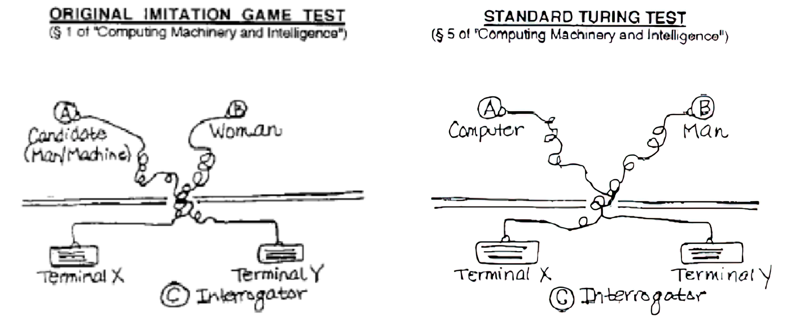

# Machine and Thought: The Turing Test

The article "Computing Machinery and Intelligence" (1950) proposes the concept of the Turing test as a starting point for exploring the relationship between **machine and thought**. 
Turing points out the difficulty of defining intelligence and determining the nature of thinking. This leads to ambiguity and the absence of a definitive answer. 
**Turing suggests a game-like format to clarify and avoid ambiguity in addressing the issue.**

## The imitation game

There are three players: 

- A: a man  
- B: a woman 
- C: an interrogator 

C stays in a separate room and doesn't know A and B's identities. C needs to discern A and B's genders only through questioning. **A**'s goal is to **deceive** C, while **B**'s goal is to **help** the interrogator.
Turing proposes a different approach to solve "Can machines think?" using a game-like format, that allows for more clarity and avoids ambiguity. Turing had an engineering attitude. He justified this shift from a philosophical question to a more quantifiable one, by wanting a question that could be answered with a clear yes or no and a measurable comparison.

> What will happen when a machine takes the part of A in this game? Will the interrogator decide wrongly as often when the game is played like this as he does when the game is played between a man and a woman?

The question is whether a machine can replace a human, specifically in playing a game, and whether its ability is comparable to that of a human.
Digital computers that have a store, executive unit, and control are considered as potential candidates for performing well in such a game. 

> Are there imaginable **digital computers** which would do well in the imitation game? Let us fix our attention on one particular digital computer C. Is it true that by modifying this computer to have an adequate storage, suitably increasing its speed of action, and providing it with an appropriate programme, C can be made to play satisfactorily the part of A in the imitation game, the part of B being taken by a man?

Turing answered:

> I believe that in about fifty years’ time it will be possible to programme computers to make them play the imitation game so well that an average interrogator will not have more that 70 per cent chance of making the right identification after five minutes of questioning”

Turing tries to **criticize his own thesis** (we will have to make this too, in our paper). He addresses various objections: 

- **Arguments from various disabilities**: machines are capable of performing almost every task, except for a few which require human skills and intelligence. Turing holds a skeptical view regarding the ability of machines to perform only routine and mechanical tasks.
- **Lady Lovelace’s objection**: Ada Lovelace argued that machines are incapable of creating anything genuinely new or surprising. In response to this, Turing stated that machines with a deductive process like "All men are mortal; Socrates is a man; Therefore, Socrates is mortal" applied on a complex and large set of premises and axioms can surprise us when inferencing.
- **Mathematical objection**: Godel and Turing, respectively, discussed the limits of state-discrete machines, raising mathematical objections to their capacities. Turing went further to suggest that these limits could also apply to human reasoning.
- *Also others not considered (also theological)* 

## Turing’s two tests for intelligence

In the Turing's paper there are two formulations of the Turing's paper. So Susan Sterrett's paper, published over 20 years ago, provides two interpretations on these two versions: Turing presented them as equivalent, Sterrett claims they are not equivalent. Sterrett's versions: 

- **Original Imitation Game**: The test allows the machine to outperform humans. The game itself does not limit the machine's ability to achieve higher scores. The test prevents the lack of the interrogator's skill from being a factor. The machine's intelligence is measured by comparing its success at tricking the interrogator with a man's. This comparison is not heavily influenced by the interrogator's skill. Both man and machine are required to impersonate. This is critical since the machine’s performance is not directly compared to the man’s, **but their rates** of successfully impersonating against a real woman candidate are compared.
- **Standard Turing Test**: The machine's performance in passing the test is based on the interrogator's skill level. The computer's task is to impersonate a human and its performance is judged based on its similarity to a human's performance.

{width=80%}

Sterrett argues that the **first version** can offer a **more accurate** assessment of the intelligence of a computing system. The test focuses on machine intelligence, not likeness to humans: the aim is to reduce emphasis on training and increase emphasis on thinking, which is necessary to impersonate. 