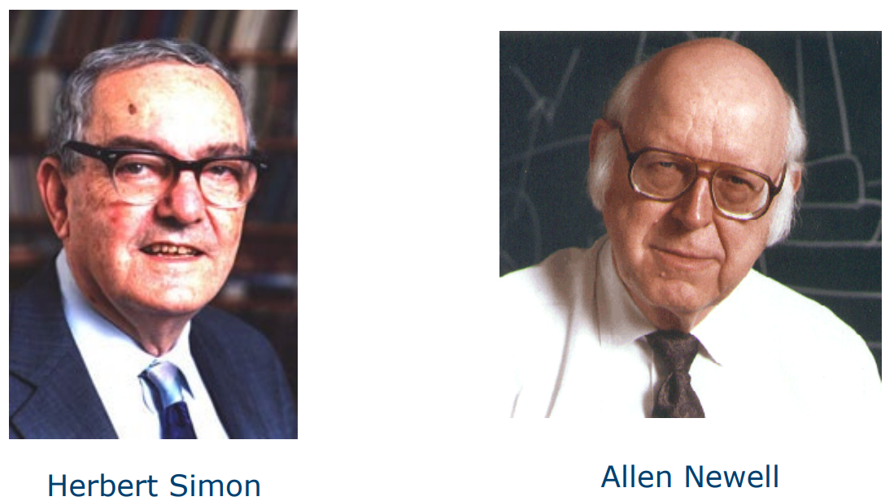

## Physical symbol system

The concept of the physical symbol system put forth by Newell and Simon in their 1976 paper.

--- 

Contex of the proposal of Physical Symbol System: 

Computer Science as Empirical Inquiry

Starting point: 

> Computer science is an empirical discipline, like astronomy, economics, and geology, and even though some of its unique forms of observation and experience **do not fit** a narrow stereotype of the experimental method, **they are experiments**. Each machine and program is an experiment that poses a question to nature, and its behavior offers clues to an answer. They are not black boxes, and wecan open them up a nd analyze them by all available means.

They basically say that: 

- Computer science is an experimental science that uses new machines and programs as experiments to analyze the relationship between the structure and behavior of these machines and programs.
- It is possible to learn from a single experiment.
- CS is a **basic science** that discovers new phenomena and analyzes known phenomena through **empirical** research.
- The development of the notion of a **symbolic** system is an example of new understanding gained through empirical research.
- In particular they explain **what symbols are**, which is a **scientific proposition** about Nature based on gradual development. Symbols are fundamental to intelligent action because the ability to store and manipulate symbols is a structural requirement for **intelligence**. Simple manipulation of symbols is essential for intelligent action, making it the condition for intelligence

According to the paper: 

- Symbols are expressions or symbol structures, for example:
	- Letters are symbols and words are expressions or symbol structures 
	- Words are symbols and sentences are expressions or symbol structures
- The system consists of symbol structures and processes that create, modify, reproduce, and destroy symbols.
- **Physical symbol system** is a machine producing through time an evolving collection of symbol structures $\leftarrow$ note that this is basically a different way to describe a **Turing Machine**. 

They also provide the definitions of "Designation" and "Interpretation" within the context of the physical symbol system, as well as the use of symbols and symbol structures. It's not necessary to understand what they mean ... rather it's important to focus on the general picture.

### Physical symbol system and computer science

The physical symbol system model is highly similar to general-purpose computers.
Why "physical"? These systems obey to physical laws and can be implemented using engineered components, and the concept of symbols is not exclusive to human symbol systems.

This paper presents a different perspective on intelligence from the one proposed by Turing.

they want to emphasize that

> Any system exhibiting general intelligence will prove upon analysis to be a physical symbol system

This imply that humans are physical symbol system. 

> Any physical symbol system of sufficient size can be organized further to exhibit general intelligence

In 1976, it was acknowledged that computers did not possess general intelligence. However, it was highlighted that physical, simple computer systems could exhibit general intelligence if appropriately organized and made large enough.

> By general intelligent action we wish to indicate the same scope of intelligence as we see in human action

The approach of measuring intelligence is strongly influenced by human intelligence and its generality. This **anthropomorphic** perspective is significant because early AI pioneers, such as Newell and Simon, struggled to develop programs with this level of generality. They faced challenges with generalization in their efforts to advance artificial intelligence.

So the recap is: 

- Symbolic capacity (to store and manipulate symbols) as the basis of intelligent behavior 
- Physical symbol system as an instance of a universal machine (general purpose computers) 
- Intelligent action performed by a system able to execute exclusively algorithmic procedures
- Human beings have the features of physical symbol systems 
- Human intelligent action can be modeled by a system able to manipulate symbols 
- Intelligence and biology: 
	- Our human wetware is not so special 
	- Intelligence can be implemented on other "platforms"

Today there are versions of this position exposed by the authors that is called **strong computationalism**  (a little bit more sophisticated but more or less present the same essence). 

### Strong computalism 

Physical symbol system as the computational model of human cognitive processes

Human cognitive activity can be simulated by a computational process 

Human cognitive activity consists of symbols manipulation

https://en.wikipedia.org/wiki/Metaphysical_solipsism

