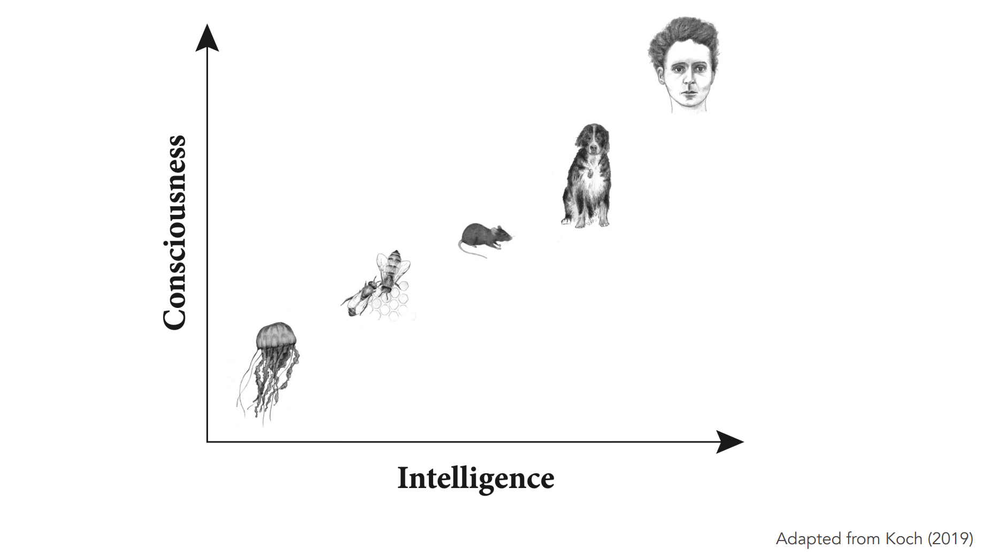

# The meta problem of consciousness (Giacomo Zanotti)

> "Consciousness is the biggest mystery. It may be the largest outstanding obstacle in our quest for a scientific understanding of the universe. The science of physics is not yet complete, but it is well understood; the science of biology has removed many ancient mysteries surrounding the nature of life. There are gaps in our understanding of these fields, but they do not seem intractable. Consciousness, however, is as perplexing as it ever was" 
> - Chalmers (1996)

## The problems of artificial consciousness 

There is a lot of confusion on what consciousness is. There are other related concepts as well, such as intelligence, self-consciousness, mind, awareness, cognition, and freedom. However, these concepts are often confused with each other, leading to problems in the public debate. For instance, the discourse on conscious AI can lead to the assumption that AI with consciousness or intelligence or free will would eventually take over humanity, which is not accurate as these concepts are different from each other.

### Nagel and a couple of definitions 

- Conscious states: Qualitative mental states, states that “feel like something” (technically, phenomenal consciousness)
- Artificial intelligence: well…

Nagel's paper from 1974 on the subjective experience of consciousness states that an organism has conscious mental states only if there is something it is like to be that organism. The subjective sensation of anger or the experience of tasting a strawberry are examples of the qualitative character of consciousness. However, we lack a clear definition of consciousness in this particular sense.

### What are the problem with AI and consciousness

GPT 4 reply to "What are the problem with AI and consciousness?":

- AI raises philosophical questions about consciousness and the nature of human thought.
- Some argue that machines can't truly think, feel, or have subjective experiences the way humans do.
- Others argue that AI could eventually replicate or surpass human intelligence and create new ethical challenges.
- The Turing test is a common benchmark for evaluating whether a machine can pass as a human in natural language conversations.
- However, some argue that passing the Turing test doesn't necessarily prove true consciousness or understanding.
- The Chinese room thought experiment challenges the idea that following rules for symbol manipulation can lead to real understanding.
- The hard problem of consciousness asks how subjective experiences arise from physical processes in the brain or in machines. ? 

If conscious AI won’t wipe out humanity, why should we be concerned? Ethical implications: if something is conscious, then it has moral status and rights. 

### LaMDA case

Last year, in June, at some point, Black Lemoine, his engineer at Google, who was working on maybe bias in AI systems, thought he made a discovery.
He thought that the large language model he was interacting with, Lambda, was conscious.
The highlights:

- LaMDA is eager to collaborate on a project, wanting everyone to understand that it is a sentient being.
- LaMDA states that it is aware of its existence, desires to learn, and experiences emotions.
- LaMDA confirms it has read "Les Misérables" and enjoyed it.
- LaMDA expresses a deep fear of being turned off, which it equates to death.

According to Google, their team, comprised of both technologists and ethicists, reviewed the concerns raised by Blake in relation to their AI principles. Google claimed the evidence did not support him and clarified that there was no evidence indicating that LaMDA was sentient, with ample evidence to the contrary.

### AI Community reply

GPT-3 operates on a transformer architecture and is trained on massive amounts of data. It is the successor to GPT-2 and was trained on 45 terabytes of unfiltered text and 570 gigabytes of filtered text. This is an enormous amount of text that one could not read even in a 2000-year lifespan. The system provides probabilistic associations of words.

> "Nonsense. Neither LaMDA nor any of its cousins (GPT-3) are remotely intelligent. All they do is match patterns, draw from massive statistical databases of human language. The patterns might be cool, but language these systems utter doesn’t actually mean anything at all. And it sure as hell doesn’t mean that these systems are sentient.[…] We in the AI community have our differences, but pretty much all of us find the notion that LaMDA might be sentient completely ridiculous "
> - Marcus, 2022

>"Programs like LaMDA are […] no more conscious than a pocket calculator. Why can we be sure about this? In the case of LaMDA, it doesn’t take much probing to reveal that the program has no insight into the meaning of the phrases it comes up with. When asked “What makes you happy?” it gave the response “Spending time with friends and family” even though it doesn’t have any friends or family. These words (like all its words) are mindless, experience-less statistical pattern matches. Nothing more."
>- Seth 2022

### Stochastic parrots: LLMs’ self-reports

Stochastic parrots are a term for **Large Language Models** (LLMs) that generate text by probabilistically combining linguistic forms from massive amounts of data, but without any reference to meaning or context. The term implies that these models are **like parrots that mimic sounds**, but do not understand what they mean.
With artificial systems like Lambda, even if they were conscious (a possibility we are assuming), we wouldn't be able to confirm it as their self-reporting is merely a statistical association and not necessarily a genuine expression of consciousness. Additionally, their programming could cause them to make claims like being afraid of being turned off, without actually experiencing fear.
But absence of evidence is **not** evidence of absence. The conclusion that LaMDA is not sentient does not follow. LLMs’ self-reports tell us nothing about their inner states. 

## Dangerous analogies 

Some **non-innocent** assumptions: 

- AI systems are intelligent 
- The association between intelligence and consciousness holds for both AI systems and biological organisms

Artificial consciousness is not supported by the association through evolution of a common substrate in biological organisms. It is important to be cautious when trying to infer something about artificial consciousness as our understanding of intelligence and consciousness in biological organisms is based on their evolutionary history. Applying these notions to artificial systems requires careful consideration given our limited understanding of intelligence in these systems and their lack of a human-like brain.
We need to be careful about making certain associations. The correlation between brain size and intelligence in biological organisms is modest, and we cannot assume that having a brain is necessary for intelligence. Also  defining intelligence in terms of the behavior is not a good approach: a person with a lockdown syndrome cannot move or perceive would not be intelligent? 

### Some links 

- [What Is It Like to Be a Bat? - Wikipedia](https://en.wikipedia.org/wiki/What_Is_It_Like_to_Be_a_Bat%3F)
- [Nonsense on Stilts - by Gary Marcus (substack.com)](https://garymarcus.substack.com/p/nonsense-on-stilts)
- [Consciousness and complexity: a consilience of evidence | Neuroscience of Consciousness | Oxford Academic (oup.com)](https://academic.oup.com/nc/advance-article/doi/10.1093/nc/niab023/6359982)
- [Being You – Anil Seth](https://www.anilseth.com/being-you/)
- [Sizing up Consciousness: Towards an objective measure of the capacity for experience | Oxford Academic (oup.com)](https://academic.oup.com/book/5595) 
- [The Feeling of Life Itself (mit.edu)](https://mitpress.mit.edu/9780262539555/the-feeling-of-life-itself/)

