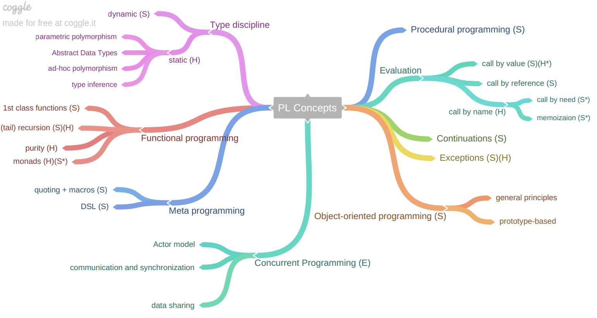

# Languages panorama

Languages we will see:

- [Scheme](00.Scheme.md) , for basics, memory management, introduction to functional programming and object orientation, meta-stuff
- [Haskell](01.Haskell.md) , for static type systems and algebraic data types, functional "purity"
- [Erlang](02.Erlang.md), for concurrency-oriented programming

Not very useful to write real stuff, more useful to learn new concepts and be flexible. Probably we will never used this languages in our careers. 
A brief history of programming languages:

- 1957 Fortran (Formula Translator)
- 1958 LISP (LISt Processor)
- 1959 COBOL (Common Business Oriented Language)
- 1960 ALGOL 60 (Algorithmic Language)
- 1964 BASIC (Beginner's All-purpose Symbolic Instruction Code)
- 1967 Simula (first object-oriented lang.)
- 1970 Pascal, Forth
- 1972 **C**, Prolog (Datalog is a non-Turing complete subset of Prolog), Smalltalk
- 1975 **Scheme** (Lisp + Algol)
- 1978 ML (Meta-Language)
- 1980 Ada
- 1983 **C++**, Objective-C
- 1984 Common Lisp (Lisp + OO)
- 1986 **Erlang**
- 1987 Perl
- 1990 **Haskell**
- 1991 Python
- 1995 Java, **JavaScript**, Ruby, PHP
- 2001 **C#** (basically a variant of Java for dot environment)
- 2002 F# 
- 2003 Scala (strange mix, quite interesting)
- 2007 Clojure 
- 2009 Go 
- 2011 Dart
- 2012 **Rust**
- 2014 Swift 

