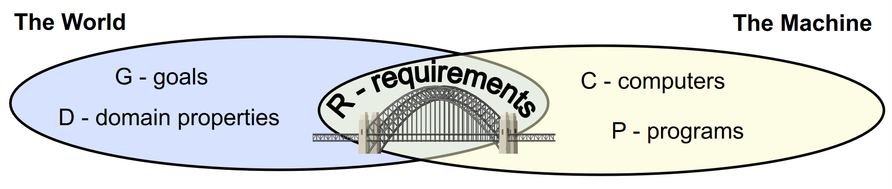

# Requirements Engineering

RE is a relatively young domain, there's no consensus on terminology yet, in particular about what is a requirement. The purpose of a RE activity is to:

- to identify the real goals of the project 
- to explore alternative ways to satisfy the goals, through alternative pairs (Requirements, Domain assumptions) such that Requirements and Domain assumptions always satisfy G 
- to evaluate the strengths and risks of each alternative interfaces between the world and the machine

Some definitions:

- **The machine** is the portion of system to be developed typically, software and hardware.
- **The world** is the portion of the real-world affected by the machine. 
- **Phenomena** can be **shared** between world and machine. Shared phenomena can be controlled by the machine and observed by the world, or viceversa.
- **D** = Domain assumptions are descriptive assertions assumed to hold in the world. They are real world properties and they don't depend on the machine.
- **G** = Goals are assertions formulated in terms of world phenomena. 
- **R** = Requirements are assertions formulated in terms of shared phenomena. 

The requirements are complete if :

1) **R** ensures satisfaction of the goals **G** in the context of the domain properties   
2) **G** adequately capture all the stakeholders’s needs  
3) **D** represents valid properties/assumptions about the world

When the domain assumptions **D** are wrong the software design could lead to disasters. Note that we are not talking about bugs on the code: problems could caused purely because bad design of the software. 

Example G-A-R: 

- Goal: The spectators want to see who is leading in all parts of the path.  
- Assumption: The error of devices in measuring the position of athletes is lower than 1 mt.
- Requirement: The system must display the position of the leading athlete on the map.

## Shared and not shared phenomenas 

| | Controlled by WORLD | Controlled by MACHINE | 
|:--:|:---:|:---:|
| **SHARED** | action initiated by the world that may trigger a reaction from the machine. |action initiated by the machine which is seen from the world| 
| **NOT SHARED** |action initiated by the world with not directly observed by the machine | "black-box action" (invisible to the world) required by the machine to function properly | 

Example: 

| Phenomenon | Shared | Who controls it |
| :--- | :--- | :--- |
| User wants to buy some milk | N | W |
| User inserts a coin in the machine | Y | W |
| The machine compares the inserted coin with the last received one | N | M |
| The machine rejects the inserted coin | Y | M |
| The machine accepts the inserted coin | Y | M |
| User inserts a fidelity card | Y | W |
| The machine checks and accepts the fidelity card | Y | M |
| The machine sees that amount needed to buy a bottle of milk is reached | N | M |
| The machine delivers the bottle of milk |  |  |
| The machine updates the current amount of money | Y | M |
| The user goes home with the milk | Y | M |
| The user wants to receive the money back | N | W |
| The user asks for the money back | N | W |
| The machine delivers the amount of money to the user | Y | W |
| The machine resets the money count | Y | M |
| The operator sets the current number of bottles in the machine | N | M |
| A milk sensor signals the milk in the machine is finishing | Y | W |
| The machine decreases the counter of the current number of bottles | N | M |
| The machine goes out of service | Y | M |

## Define use case flow

1) (Trivial) Give a name to the use case: the use case is the flow of events in the system
2) Find the actors  
3) Then concentrate on the flow of events using informal natural language:
	- entry conditions
	- exit conditions: use case terminates when the following condition holds
4) Exceptions (Describe what happens if things go wrong) 
5) Special requirements (Nonfunctional Requirements, Constraints)

Some notes:

- Note that each use case may lead to one or more requirements.
- We should separate as much as possible different activities. It's better to keep concerns separated. For example a generic use case of an app will probably need the user logged in before posting a useless meme. But in the activity of posting the meme, we will not specify **in the flow of events** the action of 'logging in' , but only in the entry conditions. 
- Requirements identification needs to take into account the needs of many stakeholders: identify priorities of requirements is the task of a requirement engineer. 
- Implementations concerns are not related to a Requirement Engineer. The RE only focus on 'the world' not the machine. 
- the requirement validation is not 'a monolitich static step'. You continue to search error: the earlier you catch the errors, the earlier you can fix them. 

