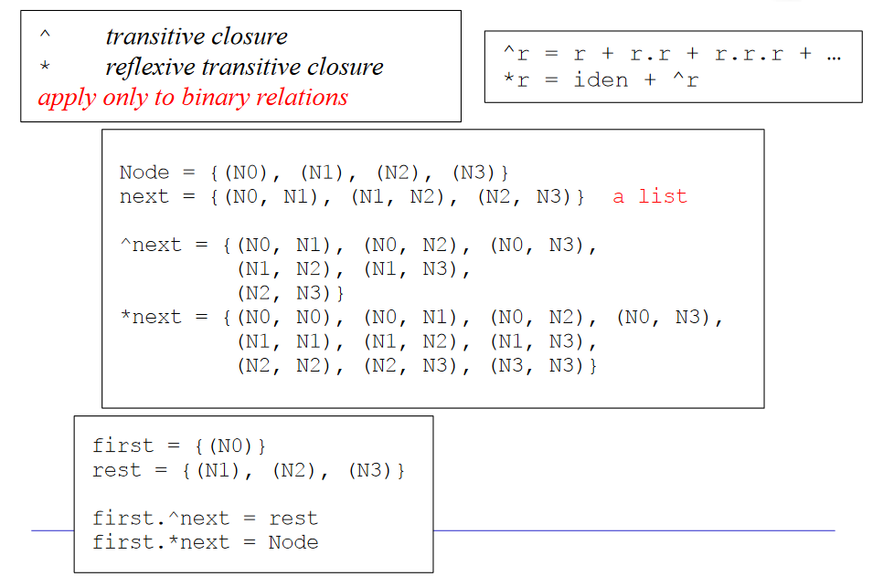

# Alloy 

Alloy is a tool for specifying models of systems and softwares with the goal of seeing if they are designed correctly. It is basically a **declarative** OO language with a strong mathematical foundation.

## Syntax 

- `sig`: Signatures define types and relationships. Alloy generates instances of each signature, called **atoms**. Since we care about the relationships between the parts of our systems we add **relations** inside of the signature body. Note that the field of each signature (the relations) are first class objects, and can be manipulated and used in expressions.
````alloy
sig sig_name{
	field: one Other_sig,
	field: set Another_sig
}
````
- `extends`: keyword we can make some signatures subtypes of other signatures. 
- `abstract` : there won't be atoms that are just the supertype but not any of the subtypes.
- We can make enums in this way: ```sig weather{Cloudy, Sunny, Rainy}```. 
- ``enum`` using subtypes:   
````Alloy
abstract sig Color {}  
one sig GREEN extends Color {}  
one sig RED extends Color {}
````
- Expression quantifiers are also used in expressions and not only in relations: 
	- some var: at least one
	- all var 
	- one var: exactly one
	- lone var : at most one
	- no var
- `disj` is used to specify distinct instances. It can be append to any expression quantifier. For example: `all disj a,b : S | expres`. 
- `none` is the empty set
- `univ` is the universal set 
- `iden` is the identity relation
- `Int` is the set of integers that have been instantiated.
- `int` returns the value of an `Int`. You have to explicitly write `int i` to be able to add, subtract, and compare an `Int`. 
- `~r`(transpose/inverse) 
````alloy
assert symmetric{  
friends = ~friends}
````
- `^r` (positive transitive closure)
````alloy
//restutuisci gli ancestori di p  
fun ancestors [p: Person]: set Person {  
p.^(mother+father)  
}
````
- `*r` (reflexive transitive closure)
{width=50%}
- `x in A` means that x is an element of the set A
- Dot join: `a.b` combines two or more sets into a single set. Remember that the match column is dropped: `(a) in A and (a,b) in F implies A.F=(b)` . Also remember a join on the right side returns the set of left side elements, and viceversa. The parenthesis are not always necessary, but in doubt put them in both cases.
- Box join: `a[b]` is equivalent to writing `a.(b)`. It has a lower precedence than the `.` operator. 
- Cross product: $\mathrm{a} \rightarrow \mathrm{b}$ (Cartesian product)
- Intersection: `a & b` (intersection of two sets, not equivalent with `and`)
- Union, difference: `a+b`, `a-b` (between sets)
- Comparison operators: in `=,<,>,=,=<,=>`
- Set comprehensions: 
````alloy
{x: Set1 | expr[x]}
{x: Set1, y: Set2, ... | expr[x,y]}
````
- expressions are mix of the last points: 
````alloy
expr1 or {
  expr2
  expr3
    ...
}
-- means expr1 or (expr 2 and expr3 and ...) 
````
- `let`:  often used to simplify expressions. 
````alloy
//let example: 

// this function returns the set of devices which host a specificsoftware module in a given system configuration
fun deployedOn [c: DeployedSystem, sm: SoftwareModule] : set Device{
	let res = {d: Device | d in c.devices and sm in d.deployed} |
	res
}
````
- Logical operators (both symbolic and english form)
|word|symbol|
|:--:|:---:|
|`and`|`&&`| 
|`or`|\|\|| 
|`not`|`!`| 
|`implies`|`=>`|
|`iff`|`<=>`|

## Predicates 

A predicate is like a programming function that returns a boolean. Predicates are mainly use to model constraints since they are **reusable expressions**.
The most used is `show()` , which is a **built-in Alloy Analyzer pred** to show us a visual rapresentation of the model specified.

### Predicates to model actions

````alloy
pred draw[c, c': Coordinator, num: Number]{  
//precondition   
not num in c. drawnNumbers   
//postcondition   
c'.tickets = c.tickets   
c'.drawnNumbers = c.drawnNumbers+num
}
````

Note that preconditions and postconditions are just comments, they are not in Alloy syntax. 
Write pre and post conditions when evaluating the effect of applying an "action" to the objects you are dealing with. Check that given certain initial conditions, after performing a certain operation, certain other properties are true. 

````Alloy
//adding new post to the social network
pred addPost [ s, s' : SocialNetwork, p : Post ] {  
	//precond
	not p in s.posts   
	p.creator in s.users 
	p.comments = none
	//postcond
	s'.users = s.users  
	s'.comments = s.comments 
	s'.posts = s.posts + p 
}
````

In the predicate's signature, you should use the following syntax:  `pred examplePred[a1,a2: A , b1,b2: B, c: C]` where `a2` and `b2` will represent respectively `a1` and `b1` changed. Typical thing I forgot: _when adding an instance to a set, remember to check that it is not already there!_

````Alloy
pred deploy[c1,c2: Config, m1: Module, d1,d2: Device]{
    //precond
    m1.tech in d1.supported
    d1 in c1.devices
    not (m1 in d1.modules)

    //post
    d2.location = d1.location
    d2.supported = d1.supported
    d2.modules = d1.modules + m1
    c2.devices = c1.devices - d1 + d2
    c2.modules = c1.modules
}
````

### Overloading

````Alloy
sig A {}
sig B {}

pred foo[a: A]{
  a in A
}

pred foo[b: B]{
  b in B
}
````

## Functions 

Alloy functions have the same structure as predicates but also return a value. Unlike functions in programming languages, they are always executed within an execution run, so their results are available in the visualisation and the evaluator even if you haven’t called them directly. This is very useful for some visualisations, although the supporting code can be disorienting when transitioning from “regular” programming languages.

````alloy
fun name[a: Set1, b: Set2]: output_type {
  expression
}
````

## Facts 

A fact is a property of the model. It's a predicate which is always considered true by the Analyzer. Any models that would violate the fact are discarded instead of checked.

````alloy
fact { 
	all m: Man, w: Woman | m.wife = w iff w.husband = m 
}

//"Nel join" tra tutte le donne e gli uomini (con la relazione wife) non ci deve essere nessun antenato comune

fact noCommonAncestorsInMarriage{  
	all p1: Man, p2: Woman |  
	p1 -> p2 in wife implies ancestors[p1] & ancestors[p2]=none  
	}  
````

We can also write constraints after the signature declaration, in this way: 

````Alloy
//this constraint avoid "self requirement"

sig Function {   
	reqs: set Function    
} {not this in reqs }
````

## Assertions

Assertions are properties we want to check.

````alloy
assert NoSelfFather {no m: Man | m = m.father}
check NoSelfFather
````

## Super basic commands 

A _command_ is what actually runs the analyzer. It can either find models that satisfy your specification, or counterexamples to given properties.

- run: finds a matching example of the specifications. You can use it with a bound: `run {} for 42 but exactly 4 Bananas, 2 Pears` .
- run {fact} : Finds an example satisfying the ad-hoc constraint in the braces.
- check: **check** tells the Analyzer to find a counterexample to a given constraint. 

## Useful links 

https://alloy.readthedocs.io/en/latest/
https://alloytools.org/download/alloy-language-reference.pdf 