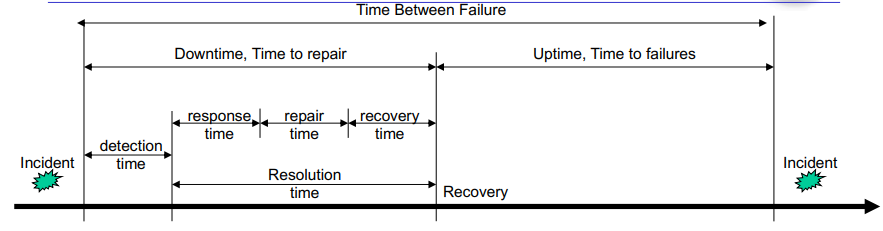

# Availability 

A couple of parameters:

- Mean Time to Repair ($MTTR$): time between the occurrence of a fault and service recovery, also known as the mean downtime.
- Mean Time To Failures ($MTTF$): time between the recovery from one incident and the occurrence of the next incident, also known as up-time. 
- Mean Time Between Failures ($MTBF$): Mean time between the occurrences of two consecutive incidents

Then we can define availability as:

$$A = \frac{MTTF}{(MTTF+MTTR)}$$

The probability that a component is working properly at time (actual uptime).

Reliability: means that the service is available for an agreed period without interruptions (frequency of interruptions). 

$$R = e - \lambda t  \text{ where } \lambda = \frac{1}{MTTF}$$

Note that a system could be available for 99% of time but have a lack of reliability since it continues to 'crash' and quickly restart. 

## Solve availability in practice 

Simple rules:

- Components in series, so the total availability is the multiplication of all the components availability. 
	$$A_{System} = A_1 * A_2 * \dots * A_{N}$$
- Components in parallel: 
$$A_{System} = (1 - (1 - A_1) * (1 - A_2) * \dots * (1 - A_{N}))$$
- The main rule to increase the availability of a system is to add in parallel another component of the one with lesser availability.  
- We repeat this process until we obtain the desired availability. 