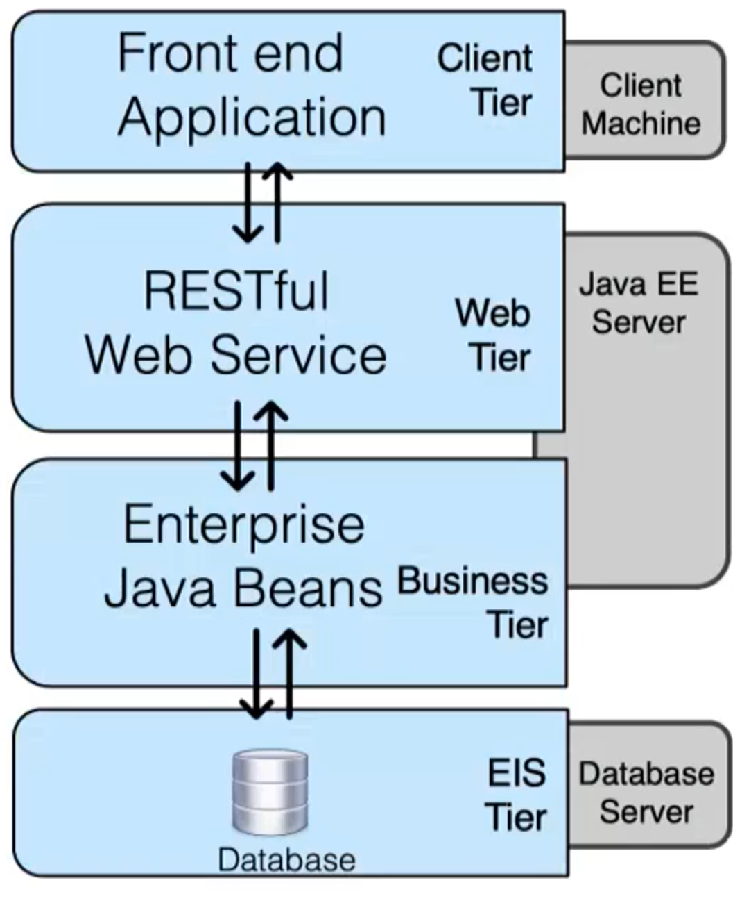
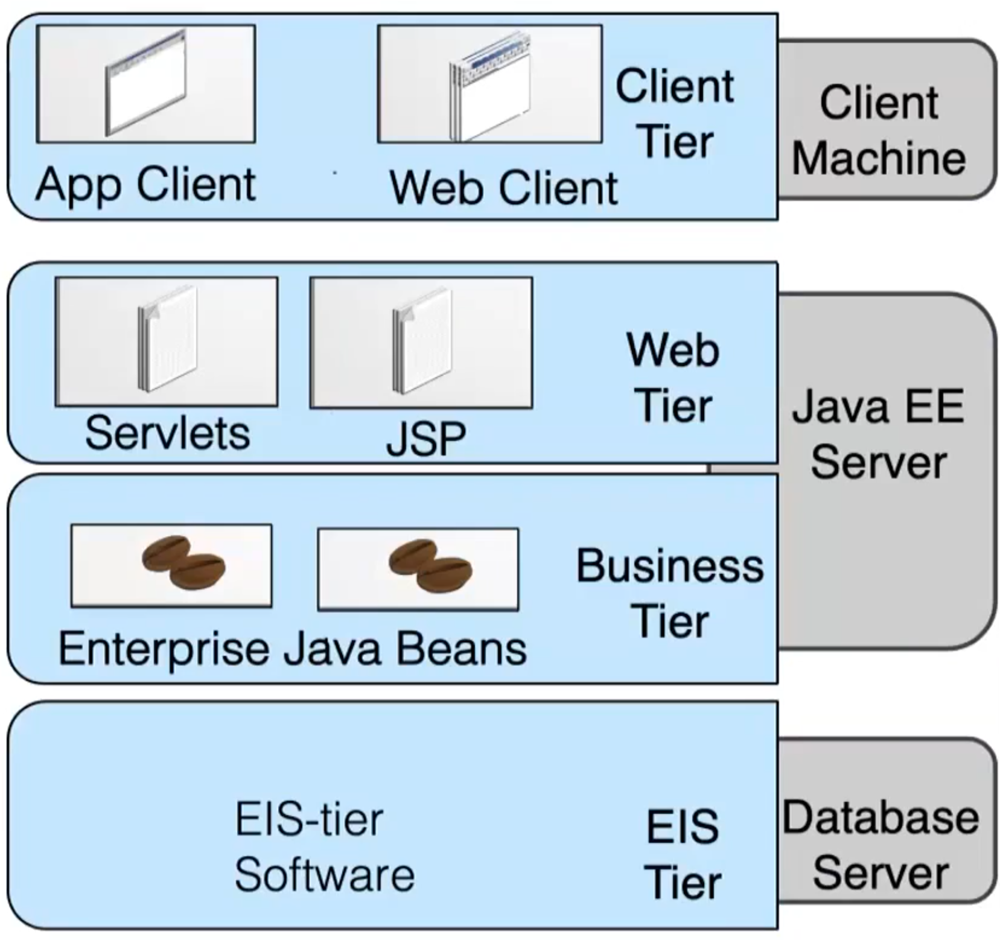

# JEE

Java Platform Enterprise Edition (JEE) is a software framework for developing enterprise applications in Java. Enterprise applications are designed to handle large amounts of data and often involve complex tasks such as source control, multi-threading, synchronization, concurrency, transaction processing, distributed systems, messaging, and service management.

JEE includes several components that assist with these tasks:

- Enterprise JavaBeans (EJBs), which contain the main business logic of the application
- Java Persistence API (JPA), which manages database connectivity and data management
- Java Messaging Service (JMS), which provides a common interface for messaging protocols to facilitate communication between distributed systems
- Java Transaction API (JTA), which specifies standard interfaces between a transaction manager and the parties involved in a distributed transaction system.

JEE follows a multi-tier architecture, with tiers for the:

- client
- web
- business
- and enterprise information system (which includes the database management system and other technologies). 

Each tier consists of logical groups of components that serve a specific purpose. Components are self-contained software units that are deployed onto the tiers of an enterprise application.

## Client tier

Java applets, which are small Java programs that are designed to be run on a client computer, were once a popular way to add interactive features to websites. However, they fell out of favor due to security concerns, as applets have the ability to run arbitrary code on the client computer, which could potentially be exploited by malicious actors.
As a result, applets are no longer widely used, instead JavaScript and HTML5 are used to add interactive features to websites.

## Web tier 

EJBs were once a popular choice for building enterprise applications, but over time, other technologies have become more widely used. In this course we will still study EJB since they are still used as legacy technology.

{width=50%}

The Java EE Server of the application is composed of various JSPs containing HTML forms and Servlets to manage them.

- **JSP**: JSP pages are typically used to create the front-end of a web application, which is the part of the application that the user interacts with, for example: a page used to registration.
- **Servlets**: Java classes that run on the server and handle requests and responses between the client and server. Generally Servlets receive user input from the JSP front-end and forwards it to the corresponding bean.
- **Bean**: a bean is a Java class that is used to store and retrieve data, often for the purpose of passing data between different layers of an application. 

{width=50%}

### Stateful and stateless beans

Session beans are of three types: 

- **Stateful Session Beans**: each bean has only one client and there is a ''conversational state'', which maintains across method invocations.
- **Stateless Session Beans**: there is no maintain any kind of ''conversational state'' , there is just a reply to a a request. 
- Singleton Session Beans: unique bean, generally used to keep system level configurations. 

Examples of stateful session beans applications:

-   A shopping cart for an online store that maintains a list of items a customer has added to their cart.
-   A customer service chat application that maintains the conversation history with a customer.
-   A social media application that maintains a user's friends list and activity feed.
-   A financial management application that maintains a user's budget and expenses.
-   A fitness tracker that maintains a user's workout history and progress.

Examples of stateless session beans applications: 

-   A currency conversion service that performs conversions between different currencies.
-   A weather information service that provides current and forecasted weather data for a location.
-   A calculator that performs mathematical calculations.
-   A search engine that provides search results for a query without any tracking information.
-   A translation service that translates text from one language to another.

### Examples of beans methods

Methods provided by UserBean:

1.  `UserEntity registerNewUser(String username, String password)` : creates and persists a new user in the database, returns the persisted UserEntity, throws an exception if the user already exists.
2.  `boolean loginUser(String username, String password)` : queries the database for a user, compares passwords and returns true if match, otherwise false.
3.  `boolean existsUser(String username)` : queries the database and returns true if user exists, otherwise false.
4.  `UserEntity getUserById(String username)` : queries the database and returns the corresponding UserEntity if exists, otherwise null.

Methods provided by ArticleBean:

1.  `ArticleEntity insertNewArticle(String title, String body, UserEntity author)` : creates and persists a new article in the database, returns the persisted ArticleEntity
2.  `void deleteArticle(ArticleEntity article)` : Removes an article from the database.
3.  `ArticleEntity getArticleById(Integer articleId)` : queries the database and returns the corresponding `ArticleEntity` if exists, otherwise ``null`.
4.  `List<ArticleEntity> getAllArticles()` : Queries the database for a list of all persisted articles.


### JMS APIs

The Java Messaging Service (JMS) is a messaging system that consists of a JMS provider, JMS clients, and messages that are exchanged between components. JMS supports point-to-point (P2P) and publish/subscribe messaging models. In the P2P model, messages are sent to specific queues and are received by receivers, while in the publish/subscribe model, messages are broadcast to subscribers using topics.

### JPA

JEE specification and API that simplifies the interaction with back-end databases providing support for relational/SQL/NoSQL databases. JPA provides an object-oriented view of the DB tables (entities in the ER model): 

- A table in the DB is represented by a class 
- Table rows are instances of this class Columns map to fields (attributes) 
- Relations between two tables are defined by properties that are common in the two classes 
- Multiplicity of a relation is declared using annotations

#### Basic JPA stuff

`@Entity` annotation is mandatory while `@Id` indicates the primary key.

```Java
@OneToOne   
@JoinColumn ( name  = "mailID") 
private MainlingAddress address;

//in MainlingAddress there the attributed annotated as ''@Id" is called "mailID"
````

Main entity relationship types of JPA are (for example, `Customer` is in `OneToMany` with Order):

- `@OneToOne`
- `@OneToMany` 
- `@ManyToOne` 
- `@ManyToMany`

Entities are managed by `EntityManager` : 

````Java
@PersistenceContext   
private EntityManager em;  
````

It can be used to make queries like for example this selection: 

````Java
public Product findProduct(int productid) {   
	return em.find(Product.class, productid); 
	}
````

Mainly there are two EM patterns: 

- direct access
- DAO (Data Access Object): better separation and better design for change. It works like an interface so that you can have for example multiple database backends that are encapsulated by the DAO.