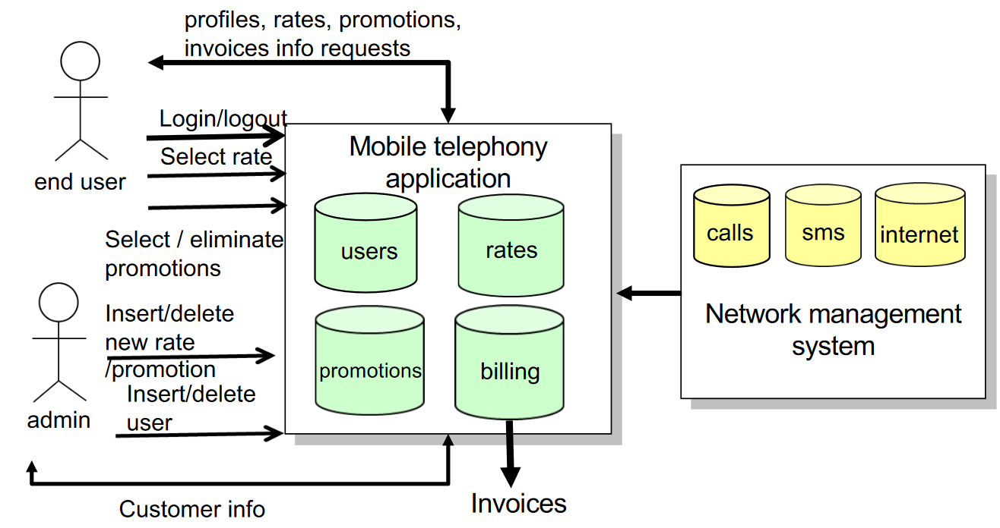

# Project Management

Main steps of Project Management are:

1. INITIATING: 
	- Define the project
	- Define initial scope
	- Estimate cost and resources
	- Define the stakeholders 
2. PLANNING:
	- Scope management plan
	- _**Schedule planning**_ <- (Gantt chart)
	- _**Cost and Effort estimation**_ <- (Function Points)
	- Quality management plan
	- Change management plan 
	- Communication management plan 
	- Risk management plan
3. EXECUTING
4. _**MONITORING AND CONTROLLING**_ <- EVA
5. CLOSING

## Schedule planning and Gantt Chart

- Tasks are activities which must be completed to achive the project goal. 
- Milestones are points in the schedule where progress can be assessed. 
- Deliverables are work products delivered to the customer (e.g documents).

How schedule is developed, managed, executed and controlled? 

- Break down project in tasks 
- Define dependencies between tasks 
- Define lag time between dependencies (even negative). 

There can be different dependencies between tasks: 

 

The **critical path** is a sequence of tasks that runs from the start to the end of the project:

- Changes to tasks on the critical path changes the project finish date. 
- A task is critical if it cannot float earlier or later.

The dependencies can be: 

- mandatory 
- discretionary 
- external: outside project's team control (ex: waiting 3rd party component completion before integration)
- internal

and also: 

- Flexible: dynamic deadline (as soon as possible .. )
- Partial flexible: bounded deadline (start no earlier than / finish no later than) 
- Inflexible: (must occur on specific time interval)

 

### Gantt chart

It can be detailed and automatically generated: 

{width=50%}

 {width=75%}

Some critical concepts: 

- The **critical path** tasks in a Gantt chart are the tasks that determine the duration of the project as they cannot be delayed without delaying the entire project. These tasks are on the main branch starting from the initial point and not the parallel tasks. Note that they are also referred to as dependent tasks, as they depend on the completion of previous tasks to start.
- **Fast-tracking** consists in pushing tasks to occur faster than they would: no cost increase but higher risk.
- **Crashing** is the practice to reduce the time dedicated to the tasks on the critical path allocating additional resources to work in parallel with the existing resources working on the task (increasing costs). Crashing is typically used on critical path tasks that take multiple days to complete, by doing multiple activities in parallel. Tasks that have lower costs are usually prioritized for crashing.

## Function points

There are two main techniques for estimating the cost of a software development project: 

- experience-based techniques, which are based on the cost of past projects
- algorithmic cost modeling, which involves using mathematical functions to estimate the cost of a project.

**Function points** and **COCOMO II** are examples of specific algorithmic techniques that can be used for estimating the cost of a project. 

In particular, function points are a measure of the functionality provided by a software system. They are calculated by identifying the number and complexity of five types of software components:

| Function Point | wtf is? | Example | Complexity |
|:---:|:---:|:---:|:--:|
| External Interface Files (EIF)| interface necessary to RECEIVE from external actors | data **received** from an external server | Simple if it's just a simple stream of data, complex if more sophisticated ways| 
| Internal Logic File (ELF)| data/classes/variables used by the app | all the classes to represent the actors involved | the number of fields for each entity and the numbers of entity | 
| External Output | elementary operation that generates data for  the external environment (not only the main user but any actor) | return the money change or show the current credit. The actors could be a customer or another company | Depends on number and complexity of outputs and the use of external services|
| External Input | elementary operation to elaborate data coming  from the external environment (not only the user) | The user insert money or spinge a button |   use of external services increases the complexity |
| External Inquiry | elementary operation that involves input and output without significant elaboration | Typical example is a query | it depends on the number of results and the complex of the objects involved|

Internal Logic Files examples with segnature:
-   Topics(topicID, description)
-   Events(eventID,topicID,body)
-   Subscriptions(subscriptionID, topicID,componentEndPoint)

Function points are used to estimate the size of a software system, and can be used in conjunction with productivity rates to estimate the time and resources required to develop the system. A generic visualization of Functions Points could be this: 

Other examples: 

 

## EVA monitoring methodology 

Monitoring involves collecting data on the current status of a project to identify any deviations from the initial plan. 
**EVA** (Earned Value Analysis) is a project management technique that allows you to track the financial progress of a project by comparing the actual work completed to the work that was planned and budgeted. 

Main stuff: 

- **BAC**: the budget at completion, which is the total budget for the project.
- **PV**: the planned value, which is the budgeted cost of work planned at a specific time of the project.
- **EV**: the earned value, which is the budgeted cost of work performed at a specific time of the project.
- **AC**: the actual cost, which is the actual cost for the completed work.
- **SV**: the schedule variance is calculated as $EV - PV$ . 
	- If $SV < 0$  means that the project is **running behind schedule** because the value produced is less than the value planned. 
- **SPI**: the schedule performance index is calculated as $\frac{EV}{PV}$.
- **CV**: The cost variance is calculated as $EV - AC$. 
	- If $CV<0$ means that the project is **running over budget** because the value produced is less than the cost. 
- **CPI**: The cost performance index is calculated as $\frac{EV}{AC}$.
- **EAC** : the expected cost at completion can be computed in three different ways, based on three different assumptions that can be used: 
	- $EAC = \frac{BAC}{CPI}$ continuing to spend at the actual/same rate.
	- $EAC = AC + (BAC - EV)$ continuing to spend at the original rate. 
	- $EAC = \frac{(AC + BAC - EV)}{CPI * SPI}$ both the CPI and SPI influencing the remaining work. 

